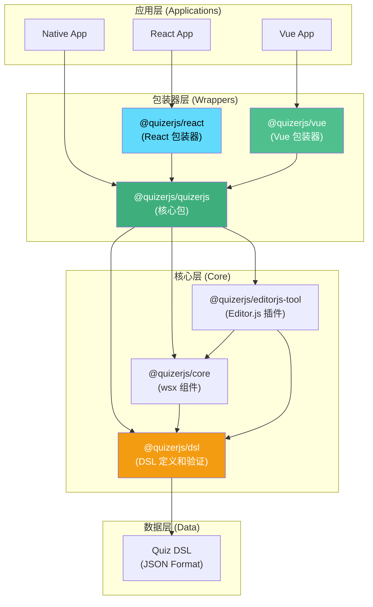
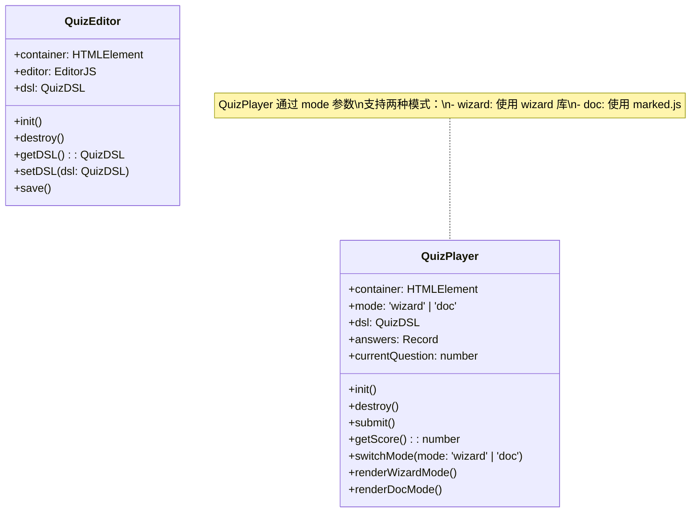
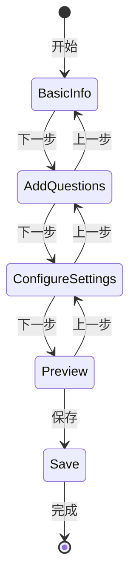
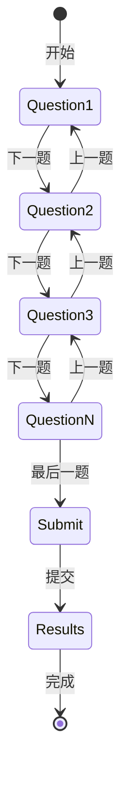
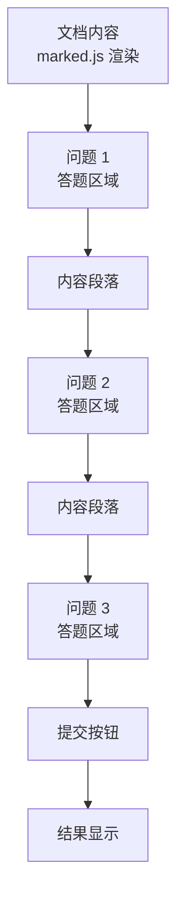

# RFC 0002: quizerjs 架构设计

**状态**: 草案 (Draft)  
**创建日期**: 2025-01-27  
**最后更新**: 2025-12-07  
**作者**: quizerjs 团队

## 摘要

本文档描述了 quizerjs 的整体架构设计，包括包结构、模块职责和组件关系。quizerjs 采用框架无关的核心设计，通过独立的集成包支持 React 和 Vue。

## 动机

- 明确各包的职责和边界
- 提供清晰的架构指导
- 保持核心包框架无关性
- 便于新开发者理解项目结构

## 核心原则

1. **框架无关**: `@quizerjs/quizerjs` 核心包不依赖任何前端框架（React/Vue）
2. **包装器模式**: React 和 Vue 包是核心包的**包装器**，不包含核心逻辑
3. **基于标准**: 使用 Editor.js 和 marked.js 等标准库
4. **可扩展**: 通过包装器支持不同框架
5. **DSL 优先**: 所有功能围绕 Quiz DSL 设计

## 架构概览



## 包结构

### @quizerjs/dsl

**职责**: Quiz DSL 定义和验证

- 定义 DSL 的 TypeScript 类型
- 提供 JSON Schema 验证
- 提供 DSL 验证器
- 提供序列化/反序列化工具

**依赖**: 无

**导出**:
- `QuizDSL` 类型
- `validateQuizDSL()` 函数
- `parseQuizDSL()` 函数
- `serializeQuizDSL()` 函数

**状态**: ✅ 已完成

### @quizerjs/core

**职责**: 核心展示组件（基于 wsx）

- 提供测验展示组件（QuizBlock）
- 提供答题交互组件
- 提供结果计算功能
- 不包含编辑功能

**依赖**: 
- `@quizerjs/dsl`
- `@wsxjs/wsx-core`

**导出**:
- `QuizBlock` 组件
- `Question` 组件
- `Option` 组件
- `calculateQuizResult()` 函数

**状态**: ✅ 已完成

### @quizerjs/quizerjs (主包)

**职责**: 框架无关的测验编辑器和播放器

- **编辑器**: 基于 Editor.js 的测验编辑器
  - 使用 Editor.js 作为核心编辑引擎
  - 输出 Quiz DSL 格式
- **播放器**: 提供测验播放功能，支持两种模式
  - **Wizard Mode**: 幻灯片风格的答题界面（使用 wizard 库实现动画）
  - **Doc Mode**: 基于 Markdown 的文档阅读和答题界面（使用 marked.js）

**依赖**:
- `@quizerjs/dsl`
- `@quizerjs/core`
- `@editorjs/editorjs` (编辑器)
- `marked` (Markdown 解析和渲染)
- `[wizard-library]` (Wizard 模式动画库，待选择)

**导出**:
- `QuizEditor` 类（基于 Editor.js）
- `QuizPlayer` 类（支持 wizard/doc 两种模式）

**类关系**:



**关键特性**:
- 框架无关（纯 JavaScript/TypeScript）
- 基于 Editor.js 的编辑器
- 基于 marked.js 的 Markdown 渲染
- 支持两种模式：Wizard（幻灯片）和 Doc（文档）

**状态**: 🚧 开发中

### @quizerjs/react

**职责**: React 包装器 - 将 `@quizerjs/quizerjs` 包装为 React 组件

- **包装核心功能**: 将 `@quizerjs/quizerjs` 的编辑器和播放器包装为 React 组件
- **React Hooks**: 提供 React Hooks（useQuizEditor, useQuizPlayer）用于状态管理
- **生命周期管理**: 处理 React 组件的挂载/卸载和状态同步
- **不包含核心逻辑**: 所有核心功能来自 `@quizerjs/quizerjs`

**依赖**:
- `@quizerjs/quizerjs` (核心包)
- `react`
- `react-dom`

**导出**:
- `<QuizEditor />` 组件（包装 `@quizerjs/quizerjs` 的编辑器）
- `<QuizPlayer />` 组件（包装 `@quizerjs/quizerjs` 的播放器，支持 mode 属性）
- `useQuizEditor()` hook（封装编辑器状态）
- `useQuizPlayer()` hook（封装播放器状态）

**实现方式**:
```tsx
// 示例：React 组件包装核心编辑器
import { QuizEditor as CoreEditor } from '@quizerjs/quizerjs';

export function QuizEditor(props) {
  const editorRef = useRef(null);
  
  useEffect(() => {
    // 创建核心编辑器实例
    const editor = new CoreEditor({
      container: editorRef.current,
      ...props
    });
    
    return () => editor.destroy();
  }, []);
  
  return <div ref={editorRef} />;
}
```

**状态**: 📋 计划中

### @quizerjs/vue

**职责**: Vue 包装器 - 将 `@quizerjs/quizerjs` 包装为 Vue 组件

- **包装核心功能**: 将 `@quizerjs/quizerjs` 的编辑器和播放器包装为 Vue 组件
- **Vue Composables**: 提供 Vue Composables 用于状态管理
- **生命周期管理**: 处理 Vue 组件的挂载/卸载和响应式状态同步
- **不包含核心逻辑**: 所有核心功能来自 `@quizerjs/quizerjs`

**依赖**:
- `@quizerjs/quizerjs` (核心包)
- `vue`

**导出**:
- `<QuizEditor />` 组件（包装 `@quizerjs/quizerjs` 的编辑器）
- `<QuizPlayer />` 组件（包装 `@quizerjs/quizerjs` 的播放器，支持 mode 属性）
- `useQuizEditor()` composable（封装编辑器状态）
- `useQuizPlayer()` composable（封装播放器状态）

**实现方式**:
```vue
<!-- 示例：Vue 组件包装核心编辑器 -->
<script setup lang="ts">
import { ref, onMounted, onUnmounted } from 'vue';
import { QuizEditor as CoreEditor } from '@quizerjs/quizerjs';

const containerRef = ref<HTMLElement | null>(null);
let editor: CoreEditor | null = null;

onMounted(() => {
  if (containerRef.value) {
    // 创建核心编辑器实例
    editor = new CoreEditor({
      container: containerRef.value,
      ...props
    });
  }
});

onUnmounted(() => {
  editor?.destroy();
});
</script>

<template>
  <div ref="containerRef" />
</template>
```

**状态**: 🚧 部分完成（已有基础组件，需要重构为包装器）

### @quizerjs/editorjs-tool

**职责**: Editor.js 工具插件

- 作为 Editor.js 的插件使用
- 在 Editor.js 编辑器中嵌入测验编辑功能
- 输出 Quiz DSL 格式

**依赖**:
- `@quizerjs/dsl`
- `@quizerjs/core`
- `@editorjs/editorjs`

**状态**: ✅ 已完成

## 编辑器设计

### Wizard Mode（向导模式）

**特点**:
- 幻灯片风格的步骤式界面
- 分步骤引导用户创建测验
- 清晰的进度指示
- 适合新手用户

**步骤流程**:



**技术实现**:
- 基于原生 JavaScript/DOM API
- 使用 CSS 实现幻灯片效果
- 状态管理使用简单的对象/类

### Doc Mode（文档模式）

**特点**:
- 基于 Markdown 的编辑界面
- 支持 Markdown 语法编写测验
- 实时预览
- 适合熟悉 Markdown 的用户

**Markdown 语法扩展**:
```markdown
# 测验标题

测验描述...

## 问题 1: 单选题

以下哪个是 JavaScript 的框架？

- [x] React (正确答案)
- [ ] Python
- [ ] Java

## 问题 2: 多选题

以下哪些是 JavaScript 的基本数据类型？

- [x] String
- [x] Number
- [x] Boolean
- [ ] Array

## 问题 3: 文本输入

ES6 中用于声明常量的关键字是什么？

答案: const

## 问题 4: 判断题

JavaScript 是一种编译型语言。

答案: false
```

**技术实现**:
- 使用 `marked.js` 解析 Markdown
- 自定义扩展语法解析
- 转换为 Quiz DSL 格式

## 播放器设计

### QuizPlayer（支持两种模式）

QuizPlayer 是一个类，通过 `mode` 参数支持两种播放模式。

#### Wizard Mode（向导模式）

**特点**:
- 幻灯片风格的答题界面
- 一题一页显示
- 流畅的动画过渡效果
- 清晰的导航（上一题/下一题）
- 进度条显示

**交互流程**:



**交互**:
- 左右箭头切换题目
- 键盘快捷键支持（← → 方向键）
- 流畅的滑动动画
- 提交后显示结果

**技术实现**:
- 使用 wizard 库实现动画效果（待选择）
- 基于原生 JavaScript/DOM API
- CSS 过渡动画

#### Doc Mode（文档模式）

**特点**:
- 完整的文档阅读体验
- 在文档中嵌入答题区域
- 支持 Markdown 渲染的内容
- 适合长文档和教程

**结构示意**:



**交互**:
- 滚动阅读
- 在相应位置答题
- 提交后显示结果和解析

**技术实现**:
- 使用 `marked.js` 解析和渲染 Markdown
- 自定义扩展语法识别问题
- 在渲染的 HTML 中嵌入答题组件

**使用示例**:
```typescript
import { QuizPlayer } from '@quizerjs/quizerjs';

// Wizard 模式
const wizardPlayer = new QuizPlayer({
  container: document.getElementById('player'),
  dsl: quizDSL,
  mode: 'wizard',
  onSubmit: (answers, score) => {
    console.log('得分:', score);
  }
});

// Doc 模式
const docPlayer = new QuizPlayer({
  container: document.getElementById('player'),
  dsl: quizDSL,
  mode: 'doc',
  onSubmit: (answers, score) => {
    console.log('得分:', score);
  }
});
```

## 数据流

### 编辑器流程

```
用户操作 → Editor (Wizard/Doc) → 内部状态 → 输出 Quiz DSL
```

### 播放器流程

```
Quiz DSL → Player (Wizard/Doc) → 渲染界面 → 用户答题 → 计算结果
```

### React 集成流程（包装器模式）

```
React Component 
  → useQuizEditor Hook (状态管理)
    → 创建 @quizerjs/quizerjs Editor 实例
      → 挂载到 DOM
        → 用户操作 → Editor 内部状态 → 输出 Quiz DSL
```

### Vue 集成流程（包装器模式）

```
Vue Component 
  → useQuizEditor Composable (状态管理)
    → 创建 @quizerjs/quizerjs Editor 实例
      → 挂载到 DOM
        → 用户操作 → Editor 内部状态 → 输出 Quiz DSL
```

**关键点**:
- React/Vue 组件只负责**生命周期管理**和**状态同步**
- 所有**核心逻辑**都在 `@quizerjs/quizerjs` 中
- 包装器通过 DOM 引用将核心实例挂载到组件中

## 设计原则

1. **DSL 优先**: 所有功能围绕 Quiz DSL 设计
2. **框架无关**: 核心包不依赖任何前端框架
3. **可组合**: 各包可独立使用
4. **类型安全**: 完整的 TypeScript 支持
5. **可扩展**: 支持未来添加新功能和新模式

## 技术选型

### 核心包 (@quizerjs/quizerjs)

- **编辑器**: Editor.js
- **Markdown**: marked.js（Doc Mode）
- **Wizard 动画库**: 待选择（见下方推荐）
- **构建工具**: tsup
- **类型系统**: TypeScript
- **无框架依赖**: 纯 JavaScript/TypeScript + DOM API

### Wizard 动画库推荐

以下是一些支持良好动画效果的 JavaScript wizard/slideshow 库：

#### 1. Swiper.js ⭐ 推荐
- **优点**: 
  - 功能强大，动画流畅
  - 支持触摸滑动
  - 轻量级（~40KB gzipped）
  - 活跃维护，文档完善
  - 支持多种过渡效果（fade, slide, cube, flip 等）
- **GitHub**: https://github.com/nolimits4web/swiper
- **大小**: ~40KB (gzipped)
- **许可证**: MIT

#### 2. Embla Carousel
- **优点**:
  - 极轻量（~2KB gzipped）
  - 模块化设计
  - 高性能
  - 支持插件扩展
- **GitHub**: https://github.com/davidcetinkaya/embla-carousel
- **大小**: ~2KB (gzipped)
- **许可证**: MIT

#### 3. Glide.js
- **优点**:
  - 轻量级（~12KB gzipped）
  - 简单易用
  - 支持触摸和键盘导航
  - 流畅的动画
- **GitHub**: https://github.com/glidejs/glide
- **大小**: ~12KB (gzipped)
- **许可证**: MIT

#### 4. Splide.js
- **优点**:
  - 零依赖
  - 轻量级（~20KB gzipped）
  - 可访问性好
  - 支持多种动画效果
- **GitHub**: https://github.com/Splidejs/splide
- **大小**: ~20KB (gzipped)
- **许可证**: MIT

#### 5. Keen Slider
- **优点**:
  - 非常轻量（~5KB gzipped）
  - 高性能
  - 灵活的 API
  - 支持触摸和鼠标拖拽
- **GitHub**: https://github.com/rcbyr/keen-slider
- **大小**: ~5KB (gzipped)
- **许可证**: MIT

### 基于文档的 Wizard 库推荐

如果您需要将 Markdown 文档转换为幻灯片风格的向导，以下是一些专门的库：

#### 1. reveal.js ⭐ 推荐（如果支持 Markdown）
- **优点**:
  - 专门用于创建 HTML 演示文稿
  - 支持 Markdown 内容
  - 丰富的过渡动画效果
  - 支持触摸和键盘导航
  - 活跃维护，文档完善
- **GitHub**: https://github.com/hakimel/reveal.js
- **大小**: ~200KB (包含所有功能)
- **许可证**: MIT
- **特点**: 可以将 Markdown 转换为幻灯片，支持代码高亮、数学公式等

#### 2. Marp
- **优点**:
  - 专门为 Markdown 演示文稿设计
  - 轻量级
  - 支持多种主题
  - 可以导出为 PDF/PPTX
- **GitHub**: https://github.com/marp-team/marp
- **特点**: 使用 Markdown 语法编写演示文稿，非常适合文档驱动的场景

#### 3. Slide.js
- **优点**:
  - 轻量级
  - 支持 Markdown
  - 简单的 API
- **GitHub**: https://github.com/julienetie/slide
- **特点**: 专注于将 Markdown 转换为幻灯片

**对于 quizerjs 的建议**:
- **Wizard Mode**: 使用 **Swiper.js** 或 **Embla Carousel**（纯 JavaScript，轻量级）
- **如果需要 Markdown 支持**: 可以考虑 **reveal.js**，但体积较大
- **最佳方案**: 使用 **Swiper.js/Embla** + **marked.js** 的组合
  - marked.js 解析 Markdown
  - Swiper/Embla 提供幻灯片动画
  - 完全控制，轻量级

### 集成包

- **React**: React Hooks + 组件包装
- **Vue**: Vue Composables + 组件包装

## 实现计划

### 阶段 1: 核心包（@quizerjs/quizerjs）

1. ✅ DSL 包完成
2. ✅ Core 包完成
3. 📋 QuizEditor 实现（基于 Editor.js）
4. 📋 QuizPlayer Wizard Mode 实现（选择并集成 wizard 库）
5. 📋 QuizPlayer Doc Mode 实现（基于 marked.js）

### 阶段 2: React 包装器

1. 📋 实现 React 编辑器组件包装器（包装 `@quizerjs/quizerjs`）
2. 📋 实现 React 播放器组件包装器（包装 `@quizerjs/quizerjs`）
3. 📋 实现 React Hooks（用于状态管理和生命周期）

### 阶段 3: Vue 包装器

1. 🚧 重构现有 Vue 组件为包装器模式（包装 `@quizerjs/quizerjs`）
2. 📋 完善 Vue Composables（用于状态管理和生命周期）

## 未来扩展

- Angular 包装器
- Svelte 包装器
- 更多编辑器模式
- 更多播放器模式
- 国际化支持
- 主题系统
- 插件系统

## 参考

- [RFC 0001: Quiz DSL 规范](./0001-quiz-dsl-specification.md)
- [Editor.js 文档](https://editorjs.io/)
- [marked.js 文档](https://marked.js.org/)
