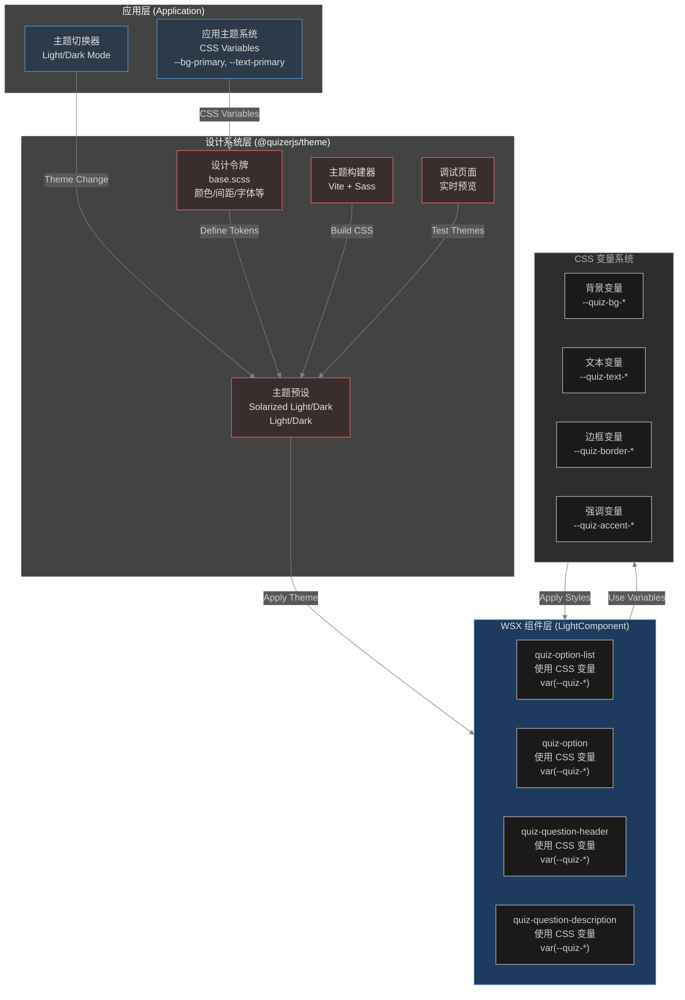
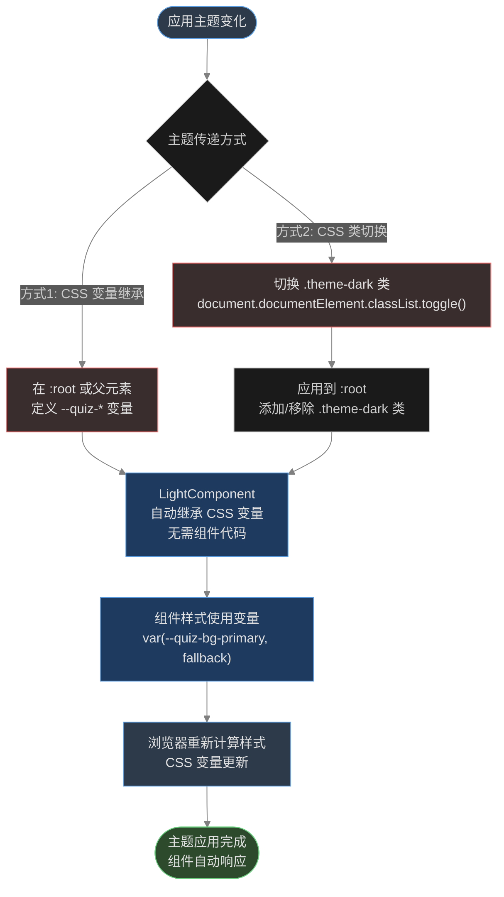
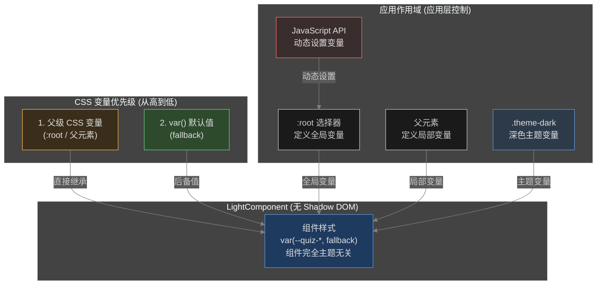
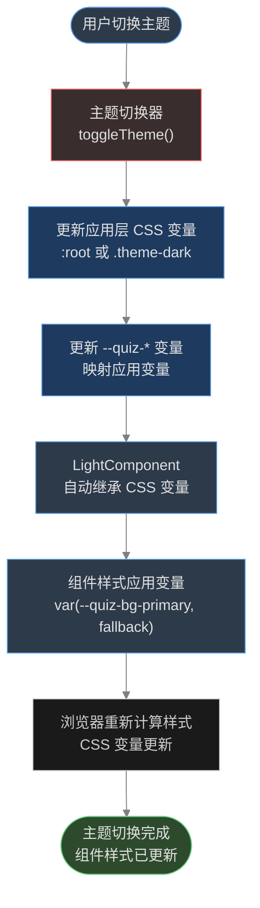

# RFC 0008: QuizerJS 设计系统

**状态**: 草案  
**创建日期**: 2025-12-14  
**作者**: quizerjs 团队  
**相关 RFC**: [RFC 0005: Editor Core](./0005-editor-core.md), [RFC 0007: Option List Render Optimization](./0007-option-list-render-optimization.md)

## 摘要

本 RFC 定义了 **QuizerJS 设计系统**，这是一个完整的、可扩展的设计语言和主题系统，用于统一 quizerjs 所有组件的视觉风格和交互体验。设计系统包括：

1. **设计令牌（Design Tokens）**：标准化的 CSS 变量系统，定义颜色、间距、字体、圆角、阴影等设计元素
2. **主题系统**：支持多套预设主题（Solarized Light/Dark、Light/Dark），支持深色/浅色模式切换
3. **组件样式规范**：统一的组件样式指南，确保所有 WSX 组件遵循一致的设计原则
4. **主题包（@quizerjs/theme）**：独立的主题包，提供预设主题和构建工具

**核心设计原则：组件完全主题无关（Theme-Agnostic）**，所有主题逻辑在应用层通过 CSS 变量处理，组件只需要使用 CSS 变量替代硬编码颜色值。这使得设计系统可以独立演进，而无需修改组件代码。

## 问题描述

### 当前问题

1. **硬编码颜色值**：所有 WSX 组件（`quiz-option-list`、`quiz-option`、`quiz-question-header`、`quiz-question-description`）都使用硬编码的颜色值（如 `#4a90e2`、`#333333`、`#ffffff`），无法响应主题变化。

2. **样式隔离**：WSX 组件使用 `LightComponent`（不使用 Shadow DOM），样式通过 `styleName` 作用域化，但硬编码的颜色值无法响应外部主题变化。

3. **样式过于固化**：组件样式设计过于具体，缺乏灵活性，用户无法轻松定制组件外观以匹配其应用设计。

4. **主题不一致**：当应用切换到深色模式时，WSX 组件仍然显示浅色样式，造成视觉不一致。

### 影响

- 用户体验差：深色模式下组件显示浅色样式，造成视觉冲突
- 定制困难：用户无法轻松调整组件颜色以匹配品牌风格
- 维护成本高：需要修改多个 CSS 文件才能改变组件样式
- 可访问性差：无法根据用户偏好调整对比度和颜色

## 设计目标

### 设计系统目标

1. **统一的设计语言**：为所有 quizerjs 组件提供一致的设计令牌和样式规范
2. **可扩展性**：设计系统可以独立演进，添加新主题或设计令牌不影响组件代码
3. **主题响应**：组件能够自动响应应用层的主题变化（深色/浅色模式）
4. **易于定制**：提供清晰的变量命名规范和默认值，支持用户自定义主题
5. **开发体验**：提供调试工具和文档，方便开发者使用和测试主题

### 技术目标

1. **CSS 变量系统**：使用标准 CSS 变量作为设计令牌，支持通过 CSS 变量传递主题
2. **组件无关性**：组件完全主题无关，所有主题逻辑在应用层处理
3. **向后兼容**：保持现有 API 不变，设计系统作为增强功能
4. **性能优化**：主题切换不应影响组件性能
5. **构建工具**：提供完善的构建系统（Vite + Sass），支持多主题构建和调试

## 设计方案

### 设计系统架构

QuizerJS 设计系统采用三层架构：

1. **设计令牌层（Design Tokens）**：`@quizerjs/theme` 包中的 `base.scss`，定义所有设计令牌（颜色、间距、字体、圆角、阴影等）
2. **主题层（Themes）**：基于设计令牌构建的预设主题（Solarized Light/Dark、Light/Dark）
3. **组件层（Components）**：WSX 组件使用设计令牌，自动响应主题变化

### 架构概览



### 1. 设计令牌（Design Tokens）命名规范

设计令牌是设计系统的基础，定义了所有可复用的设计值。QuizerJS 设计系统使用 CSS 变量作为设计令牌，遵循以下命名规范：

**命名规则**：

- 前缀：`--quiz-`（所有设计令牌统一前缀）
- 分类：按功能分类（bg、text、border、accent、spacing、radius、shadow、font、scrollbar）
- 层级：使用 `-primary`、`-secondary`、`-tertiary` 表示层级
- 状态：使用 `-hover`、`-active`、`-focus`、`-selected` 表示交互状态

定义一套标准的 CSS 变量命名规范，覆盖所有组件需要的设计元素：

```css
/* 基础颜色变量 */
--quiz-bg-primary: <color>; /* 主背景色 */
--quiz-bg-secondary: <color>; /* 次背景色 */
--quiz-bg-tertiary: <color>; /* 第三背景色 */
--quiz-bg-hover: <color>; /* 悬停背景色 */
--quiz-bg-selected: <color>; /* 选中背景色 */

/* 文本颜色变量 */
--quiz-text-primary: <color>; /* 主文本色 */
--quiz-text-secondary: <color>; /* 次文本色 */
--quiz-text-tertiary: <color>; /* 第三文本色 */
--quiz-text-placeholder: <color>; /* 占位符文本色 */

/* 边框颜色变量 */
--quiz-border-color: <color>; /* 默认边框色 */
--quiz-border-hover: <color>; /* 悬停边框色 */
--quiz-border-focus: <color>; /* 焦点边框色 */
--quiz-border-selected: <color>; /* 选中边框色 */

/* 强调色变量 */
--quiz-accent-color: <color>; /* 强调色（按钮、链接等） */
--quiz-accent-hover: <color>; /* 强调色悬停状态 */
--quiz-accent-active: <color>; /* 强调色激活状态 */

/* 状态颜色变量 */
--quiz-success-color: <color>; /* 成功状态色 */
--quiz-warning-color: <color>; /* 警告状态色 */
--quiz-error-color: <color>; /* 错误状态色 */
--quiz-info-color: <color>; /* 信息状态色 */

/* 间距变量 */
--quiz-spacing-xs: <length>; /* 超小间距（4px） */
--quiz-spacing-sm: <length>; /* 小间距（8px） */
--quiz-spacing-md: <length>; /* 中间距（12px） */
--quiz-spacing-lg: <length>; /* 大间距（16px） */
--quiz-spacing-xl: <length>; /* 超大间距（24px） */

/* 圆角变量 */
--quiz-radius-sm: <length>; /* 小圆角（4px） */
--quiz-radius-md: <length>; /* 中间角（6px） */
--quiz-radius-lg: <length>; /* 大圆角（8px） */

/* 阴影变量 */
--quiz-shadow-sm: <shadow>; /* 小阴影 */
--quiz-shadow-md: <shadow>; /* 中阴影 */
--quiz-shadow-lg: <shadow>; /* 大阴影 */

/* 字体变量 */
--quiz-font-size-sm: <length>; /* 小字体（0.75rem） */
--quiz-font-size-base: <length>; /* 基础字体（0.875rem） */
--quiz-font-size-lg: <length>; /* 大字体（1rem） */
--quiz-font-size-xl: <length>; /* 超大字体（1.25rem） */
--quiz-font-weight-normal: <weight>; /* 正常字重（400） */
--quiz-font-weight-medium: <weight>; /* 中等字重（500） */
--quiz-font-weight-semibold: <weight>; /* 半粗字重（600） */

/* 滚动条变量 */
--quiz-scrollbar-width: <length>; /* 滚动条宽度（8px） */
--quiz-scrollbar-height: <length>; /* 滚动条高度（8px） */
--quiz-scrollbar-track-color: <color>; /* 滚动条轨道颜色 */
--quiz-scrollbar-thumb-color: <color>; /* 滚动条滑块颜色 */
--quiz-scrollbar-thumb-hover-color: <color>; /* 滚动条滑块悬停颜色 */
--quiz-scrollbar-thumb-active-color: <color>; /* 滚动条滑块激活颜色 */
--quiz-scrollbar-border-radius: <length>; /* 滚动条圆角（4px） */
```

### 2. 主题传递机制

由于 `LightComponent` 不使用 Shadow DOM，CSS 变量可以直接从父级作用域继承，但仍需要通过以下方式确保主题正确传递：

#### 主题传递流程图



#### 方案 A：通过 CSS 变量继承（推荐）

由于 `LightComponent` 不使用 Shadow DOM，CSS 变量可以直接从父级作用域继承。组件内部使用 `var()` 函数的 fallback 提供默认值（基于 Solarized Light 主题）。

**CSS 变量优先级和继承关系**：



```css
/* 组件内部样式 - 使用 var() 的 fallback 提供默认值 */
/* 注意：LightComponent 不使用 Shadow DOM，不需要 :host 选择器 */
.quiz-option {
  background-color: var(--quiz-bg-primary, #fdf6e3); /* Solarized Light base3 作为默认值 */
  color: var(--quiz-text-primary, #586e75); /* Solarized Light base00 作为默认值 */
  border: 1px solid var(--quiz-border-color, #93a1a1); /* Solarized Light base1 作为默认值 */
}
```

#### 方案 B：通过 CSS 类切换主题（推荐，最简单）

使用 CSS 类来切换主题，无需 JavaScript 代码：

```css
/* 浅色主题（默认） */
:root {
  --quiz-bg-primary: #ffffff;
  --quiz-text-primary: #333333;
  --quiz-accent-color: #4a90e2;
  /* ... 其他变量 */
}

/* 深色主题 */
.theme-dark,
[data-theme='dark'] {
  --quiz-bg-primary: #1a1a1a;
  --quiz-text-primary: #e0e0e0;
  --quiz-accent-color: #5a9de2;
  /* ... 其他变量 */
}
```

```html
<!-- 切换主题只需切换类名 -->
<body class="theme-dark">
  <quiz-option-list />
</body>
```

```typescript
// 最简单的 JavaScript 切换（可选）
function toggleTheme() {
  document.documentElement.classList.toggle('theme-dark');
}
```

**优势**：纯 CSS 方案，无需工具函数，无需复杂的 JavaScript 代码。

### 3. 组件默认 CSS 变量定义

组件内部定义 CSS 变量并提供默认值（fallback），确保即使应用层不定义变量，组件也能正常显示：

```css
/* 组件内部样式 - 使用 var() 的 fallback 提供默认值 */
.quiz-option {
  background-color: var(--quiz-bg-primary, #ffffff);
  color: var(--quiz-text-primary, #333333);
  border: 1px solid var(--quiz-border-color, #e0e0e0);
}
```

**优先级**：

1. 应用层定义的 CSS 变量（`:root` 或父元素）
2. 组件内部的 fallback 默认值

### 4. 预设主题 CSS（包内提供）

在独立的 `@quizerjs/theme` 包中提供四套预设主题 CSS 文件，所有主题都基于 `base.scss` 构建，确保变量一致性和易于维护。消费者可以选择性导入：

**主题架构**：

- `base.scss`：定义所有 CSS 变量和通用样式（滚动条、基础样式等）
- 各主题 SCSS 文件：导入 `base.scss` 并覆盖颜色变量
- 构建系统：使用 Vite + Sass 编译生成 CSS 文件

#### Solarized Light 主题

文件位置：`@quizerjs/theme/solarized-light.css`

**SCSS 源码**（`src/solarized-light.scss`）：

```scss
// 导入基础样式和变量定义
@import 'base';

// 覆盖颜色变量为 Solarized Light
:root {
  // 背景色 - 基于 Solarized base3/base2/base1
  --quiz-bg-primary: #fdf6e3; // base3
  --quiz-bg-secondary: #eee8d5; // base2
  --quiz-bg-tertiary: #fdf6e3; // base3
  --quiz-bg-hover: #eee8d5; // base2
  --quiz-bg-selected: #eee8d5; // base2

  // 文本色 - 基于 Solarized base00/base01/base0
  --quiz-text-primary: #586e75; // base00
  --quiz-text-secondary: #657b83; // base01
  --quiz-text-tertiary: #839496; // base0
  --quiz-text-placeholder: #93a1a1; // base1

  // 边框色
  --quiz-border-color: #93a1a1; // base1
  --quiz-border-hover: #268bd2; // blue
  --quiz-border-focus: #268bd2; // blue
  --quiz-border-selected: #268bd2; // blue

  // 强调色 - 基于 Solarized blue
  --quiz-accent-color: #268bd2; // blue
  --quiz-accent-hover: #1e6fa8; // blue darker
  --quiz-accent-active: #15537a; // blue darkest

  // 状态色
  --quiz-error-color: #dc322f; // red
  --quiz-success-color: #859900; // green
  --quiz-warning-color: #b58900; // yellow
  --quiz-info-color: #268bd2; // blue

  // 滚动条
  --quiz-scrollbar-track-color: #eee8d5; // base2
  --quiz-scrollbar-thumb-color: #93a1a1; // base1
  --quiz-scrollbar-thumb-hover-color: #839496; // base0
  --quiz-scrollbar-thumb-active-color: #657b83; // base00
}
```

```css
/* Solarized Light Theme */
:root {
  /* 背景色 - 基于 Solarized base3/base2/base1 */
  --quiz-bg-primary: #fdf6e3; /* base3 - 最浅背景 */
  --quiz-bg-secondary: #eee8d5; /* base2 - 次背景 */
  --quiz-bg-tertiary: #fdf6e3; /* base3 - 第三背景 */
  --quiz-bg-hover: #eee8d5; /* base2 - 悬停背景 */
  --quiz-bg-selected: #eee8d5; /* base2 - 选中背景 */

  /* 文本色 - 基于 Solarized base00/base01/base0 */
  --quiz-text-primary: #586e75; /* base00 - 主文本 */
  --quiz-text-secondary: #657b83; /* base01 - 次文本 */
  --quiz-text-tertiary: #839496; /* base0 - 第三文本 */
  --quiz-text-placeholder: #93a1a1; /* base1 - 占位符 */

  /* 边框色 */
  --quiz-border-color: #93a1a1; /* base1 - 默认边框 */
  --quiz-border-hover: #268bd2; /* blue - 悬停边框 */
  --quiz-border-focus: #268bd2; /* blue - 焦点边框 */
  --quiz-border-selected: #268bd2; /* blue - 选中边框 */

  /* 强调色 - 基于 Solarized blue */
  --quiz-accent-color: #268bd2; /* blue - 主强调色 */
  --quiz-accent-hover: #1e6fa8; /* blue darker - 悬停 */
  --quiz-accent-active: #15537a; /* blue darkest - 激活 */

  /* 状态色 - 基于 Solarized 调色板 */
  --quiz-error-color: #dc322f; /* red - 错误 */
  --quiz-success-color: #859900; /* green - 成功 */
  --quiz-warning-color: #b58900; /* yellow - 警告 */
  --quiz-info-color: #268bd2; /* blue - 信息 */

  /* 间距 */
  --quiz-spacing-xs: 4px;
  --quiz-spacing-sm: 6px;
  --quiz-spacing-md: 12px;
  --quiz-spacing-lg: 16px;
  --quiz-spacing-xl: 24px;

  /* 圆角 */
  --quiz-radius-sm: 4px;
  --quiz-radius-md: 6px;
  --quiz-radius-lg: 8px;

  /* 阴影 */
  --quiz-shadow-sm: 0 1px 2px rgba(88, 110, 117, 0.1);
  --quiz-shadow-md: 0 2px 4px rgba(88, 110, 117, 0.15);
  --quiz-shadow-lg: 0 4px 8px rgba(88, 110, 117, 0.2);

  /* 字体 */
  --quiz-font-size-sm: 0.75rem;
  --quiz-font-size-base: 0.875rem;
  --quiz-font-size-lg: 1rem;
  --quiz-font-size-xl: 1.25rem;
  --quiz-font-weight-normal: 400;
  --quiz-font-weight-medium: 500;
  --quiz-font-weight-semibold: 600;

  /* 滚动条 */
  --quiz-scrollbar-width: 8px;
  --quiz-scrollbar-height: 8px;
  --quiz-scrollbar-track-color: #eee8d5; /* base2 */
  --quiz-scrollbar-thumb-color: #93a1a1; /* base1 */
  --quiz-scrollbar-thumb-hover-color: #839496; /* base0 */
  --quiz-scrollbar-thumb-active-color: #657b83; /* base00 */
  --quiz-scrollbar-border-radius: 4px;
}

/* 滚动条样式（Webkit 浏览器） */
:root::-webkit-scrollbar {
  width: var(--quiz-scrollbar-width, 8px);
  height: var(--quiz-scrollbar-height, 8px);
}

:root::-webkit-scrollbar-track {
  background: var(--quiz-scrollbar-track-color, #eee8d5);
  border-radius: var(--quiz-scrollbar-border-radius, 4px);
}

:root::-webkit-scrollbar-thumb {
  background: var(--quiz-scrollbar-thumb-color, #93a1a1);
  border-radius: var(--quiz-scrollbar-border-radius, 4px);
}

:root::-webkit-scrollbar-thumb:hover {
  background: var(--quiz-scrollbar-thumb-hover-color, #839496);
}

:root::-webkit-scrollbar-thumb:active {
  background: var(--quiz-scrollbar-thumb-active-color, #657b83);
}

/* 滚动条样式（Firefox） */
:root {
  scrollbar-width: thin;
  scrollbar-color: var(--quiz-scrollbar-thumb-color, #93a1a1)
    var(--quiz-scrollbar-track-color, #eee8d5);
}
```

#### Solarized Dark 主题

文件位置：`@quizerjs/theme/solarized-dark.css`

```css
/* Solarized Dark Theme */
:root,
.theme-dark,
[data-theme='dark'] {
  /* 背景色 - 基于 Solarized base03/base02/base01 */
  --quiz-bg-primary: #002b36; /* base03 - 最深背景 */
  --quiz-bg-secondary: #073642; /* base02 - 次背景 */
  --quiz-bg-tertiary: #002b36; /* base03 - 第三背景 */
  --quiz-bg-hover: #073642; /* base02 - 悬停背景 */
  --quiz-bg-selected: #073642; /* base02 - 选中背景 */

  /* 文本色 - 基于 Solarized base0/base1/base2 */
  --quiz-text-primary: #839496; /* base0 - 主文本 */
  --quiz-text-secondary: #93a1a1; /* base1 - 次文本 */
  --quiz-text-tertiary: #586e75; /* base00 - 第三文本 */
  --quiz-text-placeholder: #657b83; /* base01 - 占位符 */

  /* 边框色 */
  --quiz-border-color: #586e75; /* base00 - 默认边框 */
  --quiz-border-hover: #268bd2; /* blue - 悬停边框 */
  --quiz-border-focus: #268bd2; /* blue - 焦点边框 */
  --quiz-border-selected: #268bd2; /* blue - 选中边框 */

  /* 强调色 - 基于 Solarized blue */
  --quiz-accent-color: #268bd2; /* blue - 主强调色 */
  --quiz-accent-hover: #2aa198; /* cyan - 悬停 */
  --quiz-accent-active: #1e6fa8; /* blue darker - 激活 */

  /* 状态色 - 基于 Solarized 调色板 */
  --quiz-error-color: #dc322f; /* red - 错误 */
  --quiz-success-color: #859900; /* green - 成功 */
  --quiz-warning-color: #b58900; /* yellow - 警告 */
  --quiz-info-color: #268bd2; /* blue - 信息 */

  /* 间距（与浅色主题相同） */
  --quiz-spacing-xs: 4px;
  --quiz-spacing-sm: 6px;
  --quiz-spacing-md: 12px;
  --quiz-spacing-lg: 16px;
  --quiz-spacing-xl: 24px;

  /* 圆角（与浅色主题相同） */
  --quiz-radius-sm: 4px;
  --quiz-radius-md: 6px;
  --quiz-radius-lg: 8px;

  /* 阴影（深色模式调整） */
  --quiz-shadow-sm: 0 1px 2px rgba(0, 0, 0, 0.3);
  --quiz-shadow-md: 0 2px 4px rgba(0, 0, 0, 0.4);
  --quiz-shadow-lg: 0 4px 8px rgba(0, 0, 0, 0.5);

  /* 字体（与浅色主题相同） */
  --quiz-font-size-sm: 0.75rem;
  --quiz-font-size-base: 0.875rem;
  --quiz-font-size-lg: 1rem;
  --quiz-font-size-xl: 1.25rem;
  --quiz-font-weight-normal: 400;
  --quiz-font-weight-medium: 500;
  --quiz-font-weight-semibold: 600;

  /* 滚动条 */
  --quiz-scrollbar-width: 8px;
  --quiz-scrollbar-height: 8px;
  --quiz-scrollbar-track-color: #073642; /* base02 */
  --quiz-scrollbar-thumb-color: #586e75; /* base01 */
  --quiz-scrollbar-thumb-hover-color: #657b83; /* base00 */
  --quiz-scrollbar-thumb-active-color: #839496; /* base0 */
  --quiz-scrollbar-border-radius: 4px;
}

/* 滚动条样式（Webkit 浏览器） */
.theme-dark::-webkit-scrollbar,
[data-theme='dark']::-webkit-scrollbar {
  width: var(--quiz-scrollbar-width, 8px);
  height: var(--quiz-scrollbar-height, 8px);
}

.theme-dark::-webkit-scrollbar-track,
[data-theme='dark']::-webkit-scrollbar-track {
  background: var(--quiz-scrollbar-track-color, #073642);
  border-radius: var(--quiz-scrollbar-border-radius, 4px);
}

.theme-dark::-webkit-scrollbar-thumb,
[data-theme='dark']::-webkit-scrollbar-thumb {
  background: var(--quiz-scrollbar-thumb-color, #586e75);
  border-radius: var(--quiz-scrollbar-border-radius, 4px);
}

.theme-dark::-webkit-scrollbar-thumb:hover,
[data-theme='dark']::-webkit-scrollbar-thumb:hover {
  background: var(--quiz-scrollbar-thumb-hover-color, #657b83);
}

.theme-dark::-webkit-scrollbar-thumb:active,
[data-theme='dark']::-webkit-scrollbar-thumb:active {
  background: var(--quiz-scrollbar-thumb-active-color, #839496);
}

/* 滚动条样式（Firefox） */
.theme-dark,
[data-theme='dark'] {
  scrollbar-width: thin;
  scrollbar-color: var(--quiz-scrollbar-thumb-color, #586e75)
    var(--quiz-scrollbar-track-color, #073642);
}
```

**关键点**：这些 CSS 变量定义在应用层，组件通过 CSS 变量继承自动使用，组件代码完全不需要知道主题的存在。

### 4. 组件实现方案

**核心原则：组件完全主题无关（Theme-Agnostic）**

组件不应该知道主题的存在，所有主题逻辑都在应用层处理。组件只需要：

1. 使用 CSS 变量替代硬编码颜色值
2. 提供合理的默认值（fallback）
3. 不处理任何主题相关的属性或逻辑

#### 4.1 组件样式重构（主题无关）

将所有硬编码的颜色值替换为 CSS 变量，使用 `var()` 函数的 fallback 机制提供默认值。组件不需要任何主题相关的代码：

```css
/* 重构前 */
.quiz-option {
  background-color: #ffffff;
  color: #333333;
  border: 1px solid #e0e0e0;
}

/* 重构后 - 使用 CSS 变量，带默认值 */
.quiz-option {
  background-color: var(--quiz-bg-primary, #fdf6e3);
  color: var(--quiz-text-primary, #586e75);
  border: 1px solid var(--quiz-border-color, #93a1a1);
}

/* 如果组件内部有滚动容器，也应用滚动条样式 */
.quiz-option-list {
  /* ... 其他样式 */
  scrollbar-width: thin;
  scrollbar-color: var(--quiz-scrollbar-thumb-color, #93a1a1)
    var(--quiz-scrollbar-track-color, #eee8d5);
}

.quiz-option-list::-webkit-scrollbar {
  width: var(--quiz-scrollbar-width, 8px);
  height: var(--quiz-scrollbar-height, 8px);
}

.quiz-option-list::-webkit-scrollbar-track {
  background: var(--quiz-scrollbar-track-color, #eee8d5);
  border-radius: var(--quiz-scrollbar-border-radius, 4px);
}

.quiz-option-list::-webkit-scrollbar-thumb {
  background: var(--quiz-scrollbar-thumb-color, #93a1a1);
  border-radius: var(--quiz-scrollbar-border-radius, 4px);
}

.quiz-option-list::-webkit-scrollbar-thumb:hover {
  background: var(--quiz-scrollbar-thumb-hover-color, #839496);
}

.quiz-option-list::-webkit-scrollbar-thumb:active {
  background: var(--quiz-scrollbar-thumb-active-color, #657b83);
}

/* 应用层定义变量（自动继承到组件） */
:root {
  --quiz-bg-primary: #ffffff;
  --quiz-text-primary: #333333;
  --quiz-border-color: #e0e0e0;
}

.theme-dark {
  --quiz-bg-primary: #1a1a1a;
  --quiz-text-primary: #e0e0e0;
  --quiz-border-color: #404040;
}
```

### 5. 应用层集成

#### 5.1 通过 CSS 变量传递主题

由于 `LightComponent` 不使用 Shadow DOM，CSS 变量可以直接从应用层继承。在应用层定义 CSS 变量，组件会自动使用：

```css
/* 应用层样式 - 浅色主题 */
:root {
  --bg-primary: #ffffff;
  --text-primary: #333333;
  --accent-color: #4a90e2;

  /* 映射应用主题变量到组件变量 */
  --quiz-bg-primary: var(--bg-primary);
  --quiz-text-primary: var(--text-primary);
  --quiz-accent-color: var(--accent-color);
  /* ... 其他变量映射 */
}

/* 深色模式 */
.theme-dark {
  --bg-primary: #1a1a1a;
  --text-primary: #e0e0e0;
  --accent-color: #5a9de2;

  /* 组件变量自动继承应用变量 */
  --quiz-bg-primary: var(--bg-primary);
  --quiz-text-primary: var(--text-primary);
  --quiz-accent-color: var(--accent-color);
  /* ... 其他变量映射 */
}
```

**主题切换流程图**：



#### 5.2 通过 CSS 类切换主题（推荐）

使用 CSS 类切换主题，无需复杂的 JavaScript 代码：

```css
/* 浅色主题（默认） */
:root {
  --quiz-bg-primary: #ffffff;
  --quiz-text-primary: #333333;
  --quiz-accent-color: #4a90e2;
}

/* 深色主题 */
.theme-dark {
  --quiz-bg-primary: #1a1a1a;
  --quiz-text-primary: #e0e0e0;
  --quiz-accent-color: #5a9de2;
}
```

```typescript
// 最简单的切换方式
function toggleTheme() {
  document.documentElement.classList.toggle('theme-dark');
}

// 或者在 Vue/React 中
const isDark = ref(false);
watch(isDark, dark => {
  if (dark) {
    document.documentElement.classList.add('theme-dark');
  } else {
    document.documentElement.classList.remove('theme-dark');
  }
});
```

**优势**：纯 CSS 方案，无需工具函数，代码简洁。

### 6. 向后兼容性

1. **默认行为**：如果应用层不定义 CSS 变量，组件使用 `var()` 函数中的 fallback 默认值（浅色主题）
2. **渐进增强**：现有代码无需修改即可工作，主题系统作为可选增强
3. **降级处理**：如果 CSS 变量不被支持，使用 `var()` 中的 fallback 值作为后备
4. **组件无关性**：组件代码完全不变，所有主题逻辑在应用层处理

## 实施计划

### 阶段 1：设计令牌系统基础（1-2 周）

1. **设计令牌定义**：
   - 定义完整的设计令牌命名规范
   - 在 `@quizerjs/theme/base.scss` 中定义所有设计令牌（颜色、间距、字体、圆角、阴影、滚动条等）
   - 确保设计令牌覆盖所有组件需求

2. **组件重构**：
   - 重构所有 WSX 组件的 CSS，使用设计令牌替换硬编码值
   - 确保组件保持主题无关，不添加任何主题相关代码
   - 验证所有组件正确使用设计令牌

### 阶段 2：设计系统包和主题（1-2 周）

1. **创建 @quizerjs/theme 包**：
   - 创建独立的设计系统包
   - 设置 Vite + Sass 构建系统
   - 配置包导出路径

2. **SCSS 架构实现**：
   - 实现 `base.scss`，定义所有设计令牌和通用样式
   - 创建 4 个主题 SCSS 文件（solarized-light, solarized-dark, light, dark）
   - 每个主题文件导入 `base.scss` 并仅覆盖颜色令牌
   - 确保设计令牌的单一数据源原则

3. **构建系统配置**：
   - 配置 Vite 构建多个 SCSS 入口文件
   - 生成 4 个独立的 CSS 文件到 `dist/` 目录
   - 支持 watch 模式和开发调试

4. **设计系统调试工具**：
   - 创建 `index.html` 设计系统调试页面
   - 实现主题切换功能，实时预览所有主题
   - 展示所有 WSX 组件在不同主题下的效果
   - 验证设计令牌的正确应用

5. **文档和示例**：
   - 编写设计系统使用文档
   - 更新 demo 应用，展示如何导入和使用预设主题
   - 添加主题切换示例（纯 CSS 方案）
   - 创建设计令牌参考文档

### 阶段 3：设计系统增强（可选，1-2 周）

1. **设计令牌扩展**：
   - 添加更多设计令牌（动画、过渡、响应式断点等）
   - 提供设计令牌验证工具

2. **主题工具**：
   - 提供主题生成工具（从设计令牌生成新主题）
   - 添加主题预览和对比功能

3. **可访问性**：
   - WCAG 对比度检查和验证
   - 可访问性设计令牌（焦点样式、高对比度模式等）

4. **性能优化**：
   - CSS 文件大小优化
   - 主题切换性能测试和优化

## 实施细节

### 1. 文件结构

```
packages/
├── core/
│   └── src/
│       └── components/
│           ├── quiz-option-list.wsx
│           ├── quiz-option-list.css
│           ├── quiz-option.wsx
│           ├── quiz-option.css
│           ├── quiz-question-header.wsx
│           ├── quiz-question-header.css
│           ├── quiz-question-description.wsx
│           └── quiz-question-description.css
└── theme/
    ├── src/
    │   ├── index.ts                   # CLI 工具
    │   └── index.test.ts              # CLI 工具测试
    ├── styles/
    │   ├── base.scss              # 基础 SCSS 文件（定义所有变量和通用样式）
    │   ├── solarized-light.scss   # Solarized Light 主题（导入 base.scss + 覆盖变量）
    │   ├── solarized-dark.scss    # Solarized Dark 主题（导入 base.scss + 覆盖变量）
    │   ├── light.scss             # 通用浅色主题（导入 base.scss + 覆盖变量）
    │   └── dark.scss              # 通用深色主题（导入 base.scss + 覆盖变量）
    ├── dist/                      # 构建输出目录
    │   ├── solarized-light.css
    │   ├── solarized-dark.css
    │   ├── light.css
    │   └── dark.css
    ├── index.html
    ├── package.json
    ├── vite.config.ts             # 构建配置（使用 Vite + sass）
    └── tsconfig.json
```

**导出配置**（`packages/theme/package.json`）：

```json
{
  "name": "@quizerjs/theme",
  "version": "0.0.17",
  "type": "module",
  "exports": {
    "./solarized-light.css": "./dist/solarized-light.css",
    "./solarized-dark.css": "./dist/solarized-dark.css",
    "./light.css": "./dist/light.css",
    "./dark.css": "./dist/dark.css"
  },
  "scripts": {
    "build": "node build.mjs",
    "build:single": "vite build",
    "dev": "vite build --watch",
    "debug": "vite preview --open"
  },
  "devDependencies": {
    "sass": "^1.69.0",
    "vite": "^5.0.0"
  }
}
```

**构建配置**（`packages/theme/vite.config.ts`）：

```typescript
import { defineConfig } from 'vite';
import { resolve } from 'path';

// 从环境变量获取要构建的主题
const theme = process.env.THEME || 'all';

const themes = ['solarized-light', 'solarized-dark', 'light', 'dark'];

// 如果指定了单个主题，只构建该主题
const input =
  theme === 'all'
    ? Object.fromEntries(themes.map(t => [t, resolve(__dirname, `src/${t}.scss`)]))
    : { [theme]: resolve(__dirname, `src/${theme}.scss`) };

export default defineConfig({
  build: {
    outDir: 'dist',
    emptyOutDir: false, // 构建脚本会手动清理
    rollupOptions: {
      input,
      output: {
        entryFileNames: () => 'dummy.js',
        assetFileNames: assetInfo => {
          if (assetInfo.name?.endsWith('.css')) {
            // 如果只构建一个主题，使用主题名称
            if (theme !== 'all' && Object.keys(input).length === 1) {
              return `${theme}.css`;
            }
            // 多个主题时，使用 [name] 占位符
            return '[name].css';
          }
          return '[name][extname]';
        },
      },
    },
    cssCodeSplit: false, // 禁用代码分割，每个入口生成独立的 CSS 文件
  },
  css: {
    preprocessorOptions: {
      scss: {
        additionalData: `@import "${resolve(__dirname, 'src/styles/base.scss')}";`,
      },
    },
  },
});
```

**构建脚本**（`packages/theme/build.mjs`）：

由于 Vite 的 `cssCodeSplit: false` 会将多个入口点的 CSS 合并，我们使用构建脚本分别构建每个主题：

```javascript
#!/usr/bin/env node
// 构建脚本：分别构建每个主题，生成 4 个独立的 CSS 文件

import { execSync } from 'child_process';
import { fileURLToPath } from 'url';
import { dirname } from 'path';

const __filename = fileURLToPath(import.meta.url);
const __dirname = dirname(__filename);

const themes = ['solarized-light', 'solarized-dark', 'light', 'dark'];

console.log('Building themes...');

// 清理 dist 目录（只在开始时清理一次）
try {
  execSync('rm -rf dist && mkdir -p dist', { cwd: __dirname, stdio: 'inherit' });
} catch (e) {
  // 忽略错误
}

// 分别构建每个主题
for (const theme of themes) {
  console.log(`\nBuilding ${theme}...`);
  try {
    // 在 shell 命令中直接设置环境变量
    execSync(`THEME=${theme} pnpm build:single`, {
      cwd: __dirname,
      stdio: 'inherit',
      shell: '/bin/zsh',
    });
    console.log(`✓ ${theme} built successfully`);
  } catch (error) {
    console.error(`✗ Failed to build ${theme}:`, error);
    process.exit(1);
  }
}

console.log('\n✓ All themes built successfully!');
console.log('\nGenerated files:');
for (const theme of themes) {
  console.log(`  - dist/${theme}.css`);
}
```

**构建方式**：

- `pnpm build`：运行构建脚本，生成 4 个独立的 CSS 文件
- `THEME=solarized-light pnpm build:single`：单独构建指定主题

### 2. SCSS 架构设计

#### base.scss（基础文件）

```scss
// packages/theme/src/base.scss
// 定义所有 CSS 变量和通用样式

// ============================================
// 变量定义（所有主题共享的结构）
// ============================================

:root {
  // 间距变量（所有主题相同）
  --quiz-spacing-xs: 4px;
  --quiz-spacing-sm: 6px;
  --quiz-spacing-md: 12px;
  --quiz-spacing-lg: 16px;
  --quiz-spacing-xl: 24px;

  // 圆角变量（所有主题相同）
  --quiz-radius-sm: 4px;
  --quiz-radius-md: 6px;
  --quiz-radius-lg: 8px;

  // 字体变量（所有主题相同）
  --quiz-font-size-sm: 0.75rem;
  --quiz-font-size-base: 0.875rem;
  --quiz-font-size-lg: 1rem;
  --quiz-font-size-xl: 1.25rem;
  --quiz-font-weight-normal: 400;
  --quiz-font-weight-medium: 500;
  --quiz-font-weight-semibold: 600;

  // 滚动条尺寸（所有主题相同）
  --quiz-scrollbar-width: 8px;
  --quiz-scrollbar-height: 8px;
  --quiz-scrollbar-border-radius: 4px;

  // ============================================
  // 颜色变量（由各主题文件覆盖）
  // ============================================

  // 背景色（默认值，将被主题覆盖）
  --quiz-bg-primary: #ffffff;
  --quiz-bg-secondary: #fafafa;
  --quiz-bg-tertiary: #f5f5f5;
  --quiz-bg-hover: #f5f8ff;
  --quiz-bg-selected: #e8f2ff;

  // 文本色（默认值，将被主题覆盖）
  --quiz-text-primary: #333333;
  --quiz-text-secondary: #666666;
  --quiz-text-tertiary: #999999;
  --quiz-text-placeholder: #999999;

  // 边框色（默认值，将被主题覆盖）
  --quiz-border-color: #e0e0e0;
  --quiz-border-hover: #4a90e2;
  --quiz-border-focus: #4a90e2;
  --quiz-border-selected: #4a90e2;

  // 强调色（默认值，将被主题覆盖）
  --quiz-accent-color: #4a90e2;
  --quiz-accent-hover: #357abd;
  --quiz-accent-active: #2a5f8f;

  // 状态色（默认值，将被主题覆盖）
  --quiz-error-color: #ff4d4f;
  --quiz-success-color: #52c41a;
  --quiz-warning-color: #faad14;
  --quiz-info-color: #1890ff;

  // 滚动条颜色（默认值，将被主题覆盖）
  --quiz-scrollbar-track-color: #f5f5f5;
  --quiz-scrollbar-thumb-color: #cccccc;
  --quiz-scrollbar-thumb-hover-color: #999999;
  --quiz-scrollbar-thumb-active-color: #666666;

  // 阴影（默认值，将被主题覆盖）
  --quiz-shadow-sm: 0 1px 2px rgba(0, 0, 0, 0.1);
  --quiz-shadow-md: 0 2px 4px rgba(0, 0, 0, 0.15);
  --quiz-shadow-lg: 0 4px 8px rgba(0, 0, 0, 0.2);
}

// ============================================
// 通用样式（所有主题共享）
// ============================================

// 滚动条样式（Webkit 浏览器）
::-webkit-scrollbar {
  width: var(--quiz-scrollbar-width);
  height: var(--quiz-scrollbar-height);
}

::-webkit-scrollbar-track {
  background: var(--quiz-scrollbar-track-color);
  border-radius: var(--quiz-scrollbar-border-radius);
}

::-webkit-scrollbar-thumb {
  background: var(--quiz-scrollbar-thumb-color);
  border-radius: var(--quiz-scrollbar-border-radius);
}

::-webkit-scrollbar-thumb:hover {
  background: var(--quiz-scrollbar-thumb-hover-color);
}

::-webkit-scrollbar-thumb:active {
  background: var(--quiz-scrollbar-thumb-active-color);
}

// 滚动条样式（Firefox）
* {
  scrollbar-width: thin;
  scrollbar-color: var(--quiz-scrollbar-thumb-color) var(--quiz-scrollbar-track-color);
}
```

#### 主题文件示例（solarized-light.scss）

```scss
// packages/theme/src/solarized-light.scss
// 导入基础样式
@import 'base';

// 覆盖颜色变量为 Solarized Light
:root {
  // 背景色
  --quiz-bg-primary: #fdf6e3;
  --quiz-bg-secondary: #eee8d5;
  --quiz-bg-tertiary: #fdf6e3;
  --quiz-bg-hover: #eee8d5;
  --quiz-bg-selected: #eee8d5;

  // 文本色
  --quiz-text-primary: #586e75;
  --quiz-text-secondary: #657b83;
  --quiz-text-tertiary: #839496;
  --quiz-text-placeholder: #93a1a1;

  // 边框色
  --quiz-border-color: #93a1a1;
  --quiz-border-hover: #268bd2;
  --quiz-border-focus: #268bd2;
  --quiz-border-selected: #268bd2;

  // 强调色
  --quiz-accent-color: #268bd2;
  --quiz-accent-hover: #1e6fa8;
  --quiz-accent-active: #15537a;

  // 状态色
  --quiz-error-color: #dc322f;
  --quiz-success-color: #859900;
  --quiz-warning-color: #b58900;
  --quiz-info-color: #268bd2;

  // 滚动条颜色
  --quiz-scrollbar-track-color: #eee8d5;
  --quiz-scrollbar-thumb-color: #93a1a1;
  --quiz-scrollbar-thumb-hover-color: #839496;
  --quiz-scrollbar-thumb-active-color: #657b83;

  // 阴影
  --quiz-shadow-sm: 0 1px 2px rgba(88, 110, 117, 0.1);
  --quiz-shadow-md: 0 2px 4px rgba(88, 110, 117, 0.15);
  --quiz-shadow-lg: 0 4px 8px rgba(88, 110, 117, 0.2);
}
```

**优势**：

- 所有通用样式和变量结构在 `base.scss` 中定义一次
- 主题文件只需覆盖颜色变量，避免重复代码
- 添加新变量时只需更新 `base.scss`，所有主题自动继承
- 构建系统自动生成 4 个独立的 CSS 文件

### 3. 设计系统调试页面

**文件位置**：`packages/theme/index.html`

**目的**：提供交互式的设计系统测试和验证工具，帮助开发者：

- 实时预览所有主题
- 验证组件在不同主题下的表现
- 检查设计令牌的正确应用
- 测试主题切换功能
- 发现和修复设计系统问题

```html
<!DOCTYPE html>
<html lang="zh-CN">
  <head>
    <meta charset="UTF-8" />
    <meta name="viewport" content="width=device-width, initial-scale=1.0" />
    <title>QuizerJS Theme Debug</title>
    <!-- 主题样式表将通过 JavaScript 动态加载 -->
    <link rel="stylesheet" href="" id="theme-stylesheet" />
    <style>
      body {
        margin: 0;
        padding: 20px;
        font-family:
          system-ui,
          -apple-system,
          sans-serif;
      }
      .theme-selector {
        position: fixed;
        top: 20px;
        right: 20px;
        z-index: 1000;
        padding: 10px;
        background: var(--quiz-bg-secondary);
        border: 1px solid var(--quiz-border-color);
        border-radius: var(--quiz-radius-md);
      }
      .theme-selector select {
        padding: 6px 12px;
        border: 1px solid var(--quiz-border-color);
        border-radius: var(--quiz-radius-sm);
        background: var(--quiz-bg-primary);
        color: var(--quiz-text-primary);
      }
      .component-demo {
        margin: 20px 0;
        padding: 20px;
        background: var(--quiz-bg-primary);
        border: 1px solid var(--quiz-border-color);
        border-radius: var(--quiz-radius-md);
      }

      .demo-description {
        font-size: 0.875rem;
        color: var(--quiz-text-secondary);
        margin-bottom: 12px;
      }

      .scrollable-demo {
        max-height: 400px;
      }

      .tokens-section {
        margin-top: 40px;
        padding: 20px;
        background: var(--quiz-bg-secondary);
        border: 1px solid var(--quiz-border-color);
        border-radius: var(--quiz-radius-md);
      }

      .tokens-grid {
        display: grid;
        grid-template-columns: repeat(auto-fit, minmax(200px, 1fr));
        gap: 16px;
        margin-top: 16px;
      }

      .token-item {
        display: flex;
        align-items: center;
        gap: 12px;
        padding: 12px;
        background: var(--quiz-bg-primary);
        border: 1px solid var(--quiz-border-color);
        border-radius: var(--quiz-radius-sm);
      }

      .token-color {
        width: 40px;
        height: 40px;
        border-radius: var(--quiz-radius-sm);
        border: 1px solid var(--quiz-border-color);
        flex-shrink: 0;
      }

      .token-item code {
        flex: 1;
        font-size: 0.875rem;
        color: var(--quiz-text-primary);
      }

      .token-value {
        font-size: 0.75rem;
        color: var(--quiz-text-secondary);
        font-family: monospace;
      }
    </style>
  </head>
  <body>
    <div class="theme-selector">
      <label for="theme-select">主题：</label>
      <select id="theme-select">
        <option value="solarized-light">Solarized Light</option>
        <option value="solarized-dark">Solarized Dark</option>
        <option value="light">Light</option>
        <option value="dark">Dark</option>
      </select>
    </div>

    <h1>QuizerJS 主题调试页面</h1>

    <!-- 组件示例区域 -->
    <section class="components-section">
      <h2>组件示例</h2>

      <div class="component-demo">
        <h3>quiz-option-list（单选）</h3>
        <p class="demo-description">测试选项列表的背景、边框、文本颜色和交互状态</p>
        <quiz-option-list
          options='[{"id":"1","text":"选项 1"},{"id":"2","text":"选项 2"},{"id":"3","text":"选项 3"}]'
          type="single"
        ></quiz-option-list>
      </div>

      <div class="component-demo">
        <h3>quiz-option-list（多选）</h3>
        <p class="demo-description">测试多选模式下的样式</p>
        <quiz-option-list
          options='[{"id":"1","text":"选项 A"},{"id":"2","text":"选项 B"},{"id":"3","text":"选项 C"}]'
          type="multiple"
        ></quiz-option-list>
      </div>

      <div class="component-demo">
        <h3>quiz-option（单个选项）</h3>
        <p class="demo-description">测试单个选项的选中、悬停、焦点状态</p>
        <quiz-option option-id="1" text="未选中选项（悬停查看效果）"></quiz-option>
        <quiz-option option-id="2" text="已选中选项" selected></quiz-option>
      </div>

      <div class="component-demo">
        <h3>quiz-question-header</h3>
        <p class="demo-description">测试标题的字体、颜色、必填标记</p>
        <quiz-question-header title="普通问题标题"></quiz-question-header>
        <quiz-question-header title="必填问题标题" required></quiz-question-header>
      </div>

      <div class="component-demo">
        <h3>quiz-question-description</h3>
        <p class="demo-description">测试描述文本的颜色和字体大小</p>
        <quiz-question-description
          description="这是问题的描述文本，用于说明问题的背景和要求。描述文本应该清晰易读，颜色对比度符合可访问性标准。"
        ></quiz-question-description>
      </div>

      <div class="component-demo scrollable-demo">
        <h3>滚动条测试</h3>
        <p class="demo-description">测试滚动条样式（需要滚动查看）</p>
        <div
          style="height: 200px; overflow-y: auto; border: 1px solid var(--quiz-border-color); padding: 10px;"
        >
          <p>这是一个可滚动的容器，用于测试滚动条样式。</p>
          <p>滚动条轨道颜色：<code>--quiz-scrollbar-track-color</code></p>
          <p>滚动条滑块颜色：<code>--quiz-scrollbar-thumb-color</code></p>
          <p>悬停时滑块颜色：<code>--quiz-scrollbar-thumb-hover-color</code></p>
          <p>请向下滚动查看更多内容...</p>
          <p
            style="height: 500px; background: var(--quiz-bg-secondary); padding: 20px; margin: 10px 0;"
          >
            这是足够长的内容，用于触发滚动条显示。 在不同主题下，滚动条的颜色应该与主题保持一致。
          </p>
        </div>
      </div>
    </section>

    <!-- 设计令牌展示区域 -->
    <section class="tokens-section">
      <h2>设计令牌预览</h2>
      <div class="tokens-grid">
        <div class="token-item">
          <div class="token-color" style="background: var(--quiz-bg-primary);"></div>
          <code>--quiz-bg-primary</code>
          <span class="token-value" id="token-bg-primary"></span>
        </div>
        <div class="token-item">
          <div class="token-color" style="background: var(--quiz-text-primary);"></div>
          <code>--quiz-text-primary</code>
          <span class="token-value" id="token-text-primary"></span>
        </div>
        <div class="token-item">
          <div class="token-color" style="background: var(--quiz-accent-color);"></div>
          <code>--quiz-accent-color</code>
          <span class="token-value" id="token-accent-color"></span>
        </div>
        <div class="token-item">
          <div class="token-color" style="background: var(--quiz-border-color);"></div>
          <code>--quiz-border-color</code>
          <span class="token-value" id="token-border-color"></span>
        </div>
      </div>
    </section>

    <script type="module">
      import '@quizerjs/core';

      const themeSelect = document.getElementById('theme-select');
      const themeStylesheet = document.getElementById('theme-stylesheet');

      // 主题切换函数
      function switchTheme(themeName) {
        // 动态更新样式表链接
        const newHref = `../dist/${themeName}.css`;

        // 如果样式表已存在且链接不同，则更新
        if (themeStylesheet.href !== new URL(newHref, window.location.href).href) {
          themeStylesheet.href = newHref;
        }
      }

      // 从 URL 参数或 localStorage 读取初始主题
      function getInitialTheme() {
        // 1. 检查 URL 参数
        const urlParams = new URLSearchParams(window.location.search);
        const themeFromUrl = urlParams.get('theme');
        if (
          themeFromUrl &&
          ['solarized-light', 'solarized-dark', 'light', 'dark'].includes(themeFromUrl)
        ) {
          return themeFromUrl;
        }

        // 2. 检查 localStorage
        const themeFromStorage = localStorage.getItem('quizerjs-debug-theme');
        if (
          themeFromStorage &&
          ['solarized-light', 'solarized-dark', 'light', 'dark'].includes(themeFromStorage)
        ) {
          return themeFromStorage;
        }

        // 3. 默认使用 Solarized Light
        return 'solarized-light';
      }

      // 初始化主题
      const initialTheme = getInitialTheme();
      themeSelect.value = initialTheme;
      switchTheme(initialTheme);

      // 监听主题选择器变化
      themeSelect.addEventListener('change', e => {
        const selectedTheme = e.target.value;

        // 切换主题
        switchTheme(selectedTheme);

        // 保存到 localStorage
        localStorage.setItem('quizerjs-debug-theme', selectedTheme);

        // 更新 URL 参数（不刷新页面）
        const url = new URL(window.location);
        url.searchParams.set('theme', selectedTheme);
        window.history.replaceState({}, '', url);

        // 更新设计令牌显示
        updateTokenDisplay();
      });

      // 更新设计令牌显示
      function updateTokenDisplay() {
        // 等待样式表加载完成
        setTimeout(() => {
          const styles = getComputedStyle(document.documentElement);
          const tokenMap = {
            '--quiz-bg-primary': 'token-bg-primary',
            '--quiz-text-primary': 'token-text-primary',
            '--quiz-accent-color': 'token-accent-color',
            '--quiz-border-color': 'token-border-color',
          };

          Object.entries(tokenMap).forEach(([token, elementId]) => {
            const value = styles.getPropertyValue(token).trim();
            const element = document.getElementById(elementId);
            if (element) {
              element.textContent = value || '未定义';
            }
          });
        }, 100); // 给样式表加载一些时间
      }

      // 监听样式表加载完成
      themeStylesheet.addEventListener('load', () => {
        updateTokenDisplay();
      });

      // 初始化时显示令牌值
      updateTokenDisplay();

      // 定期更新令牌显示（防止样式表加载延迟）
      setInterval(updateTokenDisplay, 500);
    </script>
  </body>
</html>
```

**调试页面功能**：

- 实时切换 4 个主题预览
- 展示所有 WSX 组件在不同主题下的效果
- 验证 CSS 变量是否正确应用
- 检查滚动条样式
- 验证深色/浅色模式切换

#### 如何使用调试页面

**1. 启动调试页面**：

```bash
# 在 @quizerjs/theme 包目录下
cd packages/theme

# 构建主题 CSS 文件
pnpm build

# 启动调试服务器（使用 Vite preview）
pnpm debug

# 或者手动启动
vite preview --open
```

调试页面将在浏览器中自动打开，默认地址为 `http://localhost:4173/`。

**2. 测试主题切换**：

- **方式 1：使用主题选择器**
  - 点击页面右上角的主题选择器下拉菜单
  - 选择不同主题（Solarized Light、Solarized Dark、Light、Dark）
  - 样式表链接会动态更新：`theme-stylesheet.href = '../dist/${theme}.css'`
  - 观察页面和组件的样式变化
  - 验证主题切换是否流畅，无闪烁

- **方式 2：通过 URL 参数**
  - 在 URL 后添加 `?theme=solarized-dark` 参数
  - 例如：`http://localhost:4173/?theme=solarized-dark`
  - 页面加载时会自动应用指定主题
  - 支持的主题值：`solarized-light`、`solarized-dark`、`light`、`dark`

- **方式 3：通过浏览器控制台**

  ```javascript
  // 直接切换主题
  document.getElementById('theme-stylesheet').href = '../dist/solarized-dark.css';

  // 或触发选择器变化
  document.getElementById('theme-select').value = 'solarized-dark';
  document.getElementById('theme-select').dispatchEvent(new Event('change'));
  ```

**主题切换机制说明**：

- 样式表链接（`<link id="theme-stylesheet">`）通过 JavaScript 动态更新
- 切换时更新 `href` 属性，浏览器自动加载新的 CSS 文件
- 主题选择会保存到 `localStorage`，下次访问时自动恢复
- URL 参数会同步更新，方便分享特定主题的调试页面链接

**3. 验证组件样式**：

调试页面包含以下组件示例，用于验证主题应用：

- **quiz-option-list**：测试选项列表的背景色、文本色、边框色、悬停效果
- **quiz-option**：测试单个选项的选中状态、悬停状态
- **quiz-question-header**：测试标题的字体、颜色、必填标记样式
- **quiz-question-description**：测试描述文本的颜色和字体

**测试检查点**：

- [ ] 背景色是否正确应用（`--quiz-bg-primary`、`--quiz-bg-secondary`）
- [ ] 文本颜色是否清晰可读（`--quiz-text-primary`、`--quiz-text-secondary`）
- [ ] 边框颜色是否正确（`--quiz-border-color`）
- [ ] 强调色是否正确（`--quiz-accent-color`）
- [ ] 悬停状态是否正常（`:hover` 伪类）
- [ ] 选中状态是否明显（`selected` 属性）

**4. 检查滚动条样式**：

- 在包含滚动内容的组件中（如 `quiz-option-list`），测试滚动条样式
- 验证滚动条轨道颜色（`--quiz-scrollbar-track-color`）
- 验证滚动条滑块颜色（`--quiz-scrollbar-thumb-color`）
- 测试滚动条悬停效果（`--quiz-scrollbar-thumb-hover-color`）
- 验证滚动条在不同浏览器中的表现（Chrome/Safari 使用 Webkit，Firefox 使用 `scrollbar-color`）

**5. 验证 CSS 变量**：

使用浏览器开发者工具检查 CSS 变量：

```javascript
// 在浏览器控制台中执行
// 检查当前应用的 CSS 变量值
getComputedStyle(document.documentElement).getPropertyValue('--quiz-bg-primary');
getComputedStyle(document.documentElement).getPropertyValue('--quiz-text-primary');
getComputedStyle(document.documentElement).getPropertyValue('--quiz-accent-color');

// 列出所有 --quiz-* 变量
const styles = getComputedStyle(document.documentElement);
Array.from(document.styleSheets)
  .flatMap(sheet => Array.from(sheet.cssRules))
  .filter(rule => rule.style)
  .flatMap(rule => Array.from(rule.style))
  .filter(prop => prop.startsWith('--quiz-'))
  .forEach(prop => {
    console.log(`${prop}: ${styles.getPropertyValue(prop)}`);
  });
```

**6. 测试交互状态**：

- **悬停测试**：鼠标悬停在按钮、选项上，验证 `--quiz-accent-hover`、`--quiz-bg-hover` 是否正确应用
- **选中测试**：点击选项，验证 `--quiz-bg-selected`、`--quiz-border-selected` 是否正确应用
- **焦点测试**：使用 Tab 键导航，验证 `--quiz-border-focus` 是否正确应用

**7. 对比度检查**：

使用浏览器开发者工具或在线工具检查文本对比度：

- 主文本（`--quiz-text-primary`）与主背景（`--quiz-bg-primary`）的对比度应 ≥ 4.5:1（WCAG AA）
- 次文本（`--quiz-text-secondary`）与主背景的对比度应 ≥ 3:1（WCAG AA Large Text）

**8. 深色模式验证**：

切换到深色主题（Solarized Dark 或 Dark）后验证：

- [ ] 背景色足够深，不会造成眼睛疲劳
- [ ] 文本颜色足够亮，保持良好的可读性
- [ ] 滚动条在深色背景下清晰可见
- [ ] 所有交互状态在深色模式下都清晰可见

**9. 响应式测试**：

- 调整浏览器窗口大小，验证组件在不同屏幕尺寸下的表现
- 测试移动设备视图（使用浏览器开发者工具的响应式模式）

**10. 性能测试**：

- 快速切换主题，验证是否有性能问题
- 检查主题切换时的重绘和重排
- 验证 CSS 变量更新是否流畅

### 4. 组件修改示例

#### quiz-option-list.css

```css
/* 注意：LightComponent 不使用 Shadow DOM，不需要 :host 选择器 */
/* CSS 变量直接从父级作用域继承，使用 var() 的 fallback 提供默认值 */

.quiz-option-list {
  margin: var(--quiz-spacing-lg, 16px) 0;
}

.quiz-option-list-title {
  font-size: var(--quiz-font-size-base, 0.875rem);
  font-weight: var(--quiz-font-weight-semibold, 600);
  color: var(--quiz-text-secondary, #666666);
}

.quiz-option-list-add-button {
  padding: var(--quiz-spacing-sm, 6px) var(--quiz-spacing-md, 12px);
  border: 1px solid var(--quiz-accent-color, #4a90e2);
  border-radius: var(--quiz-radius-sm, 4px);
  background-color: var(--quiz-accent-color, #4a90e2);
  color: #ffffff; /* 按钮文字始终为白色 */
  cursor: pointer;
  font-size: var(--quiz-font-size-base, 0.875rem);
  transition: all 0.2s ease;
}

.quiz-option-list-add-button:hover {
  background-color: var(--quiz-accent-hover, #357abd);
  border-color: var(--quiz-accent-hover, #357abd);
}
```

#### quiz-option-list.wsx

**组件保持主题无关，不需要任何主题相关代码**：

```typescript
@autoRegister({ tagName: 'quiz-option-list' })
export class QuizOptionList extends LightComponent {
  // 组件不包含任何主题相关的状态或方法
  // 所有主题逻辑在应用层通过 CSS 变量处理

  static get observedAttributes() {
    return ['options', 'type', 'readonly'];
    // 注意：不包含 'theme' 属性
  }

  protected onAttributeChanged(name: string, _oldValue: string, newValue: string) {
    switch (name) {
      case 'options':
        // ... 处理选项
        break;
      case 'type':
        // ... 处理类型
        break;
      case 'readonly':
        // ... 处理只读模式
        break;
      // 不处理 theme 属性
    }
  }
}
```

### 3. 预设主题 CSS（可选，供参考）

提供预设主题的 CSS 变量定义，应用层可以直接复制使用：

```css
/* packages/theme/src/solarized-light.css */
/* Solarized Light 主题 */
:root {
  --quiz-bg-primary: #ffffff;
  --quiz-bg-secondary: #fafafa;
  --quiz-bg-tertiary: #f5f5f5;
  --quiz-bg-hover: #f5f8ff;
  --quiz-bg-selected: #e8f2ff;

  --quiz-text-primary: #333333;
  --quiz-text-secondary: #666666;
  --quiz-text-tertiary: #999999;
  --quiz-text-placeholder: #999999;

  --quiz-border-color: #e0e0e0;
  --quiz-border-hover: #4a90e2;
  --quiz-border-focus: #4a90e2;
  --quiz-border-selected: #4a90e2;

  --quiz-accent-color: #4a90e2;
  --quiz-accent-hover: #357abd;
  --quiz-accent-active: #2a5f8f;

  --quiz-error-color: #ff4d4f;
  --quiz-success-color: #52c41a;
  --quiz-warning-color: #faad14;
  --quiz-info-color: #1890ff;
}

/* 深色主题 */
.theme-dark,
[data-theme='dark'] {
  --quiz-bg-primary: #1a1a1a;
  --quiz-bg-secondary: #262626;
  --quiz-bg-tertiary: #2d2d2d;
  --quiz-bg-hover: #2d3a4a;
  --quiz-bg-selected: #1e3a5f;

  --quiz-text-primary: #e0e0e0;
  --quiz-text-secondary: #b0b0b0;
  --quiz-text-tertiary: #808080;
  --quiz-text-placeholder: #666666;

  --quiz-border-color: #404040;
  --quiz-border-hover: #5a9de2;
  --quiz-border-focus: #5a9de2;
  --quiz-border-selected: #5a9de2;

  --quiz-accent-color: #5a9de2;
  --quiz-accent-hover: #4a8dd2;
  --quiz-accent-active: #3a7dc2;

  --quiz-error-color: #ff6b6b;
  --quiz-success-color: #6bcf7f;
  --quiz-warning-color: #ffb84d;
  --quiz-info-color: #4da6ff;
}
```

**使用方式**：应用层可以直接导入这个 CSS 文件，或复制变量定义到自己的样式文件中。

## 使用示例

### 示例 1：使用预设主题（最简单）

```typescript
// 方式 1：在应用入口导入
import '@quizerjs/theme/solarized-light.css';
```

```css
/* 方式 2：在 CSS 中导入 */
@import '@quizerjs/theme/solarized-light.css';
```

```html
<!-- 方式 3：在 HTML 中引入 -->
<link rel="stylesheet" href="node_modules/@quizerjs/theme/dist/solarized-light.css" />
```

```html
<!-- 组件自动使用预设主题的 CSS 变量 -->
<quiz-option-list />
<quiz-option />
<quiz-question-header />
```

**切换深色主题**：

```typescript
// 动态导入
import '@quizerjs/theme/solarized-dark.css';
// 或通过类名切换
document.documentElement.classList.add('theme-dark');
```

### 示例 2：通过 CSS 类切换主题（最简单）

```css
/* 应用层样式 */
:root {
  --quiz-bg-primary: #ffffff;
  --quiz-text-primary: #333333;
  --quiz-accent-color: #4a90e2;
}

.theme-dark {
  --quiz-bg-primary: #1a1a1a;
  --quiz-text-primary: #e0e0e0;
  --quiz-accent-color: #5a9de2;
}
```

```html
<!-- 组件自动响应主题 -->
<body class="theme-dark">
  <quiz-option-list />
</body>
```

```typescript
// 最简单的切换方式（可选）
function toggleTheme() {
  document.documentElement.classList.toggle('theme-dark');
}

// 或者在 Vue/React 中
const isDark = ref(false);
watch(isDark, dark => {
  if (dark) {
    document.documentElement.classList.add('theme-dark');
  } else {
    document.documentElement.classList.remove('theme-dark');
  }
});
```

### 示例 3：自定义主题变量

```css
/* 应用层定义自定义主题 */
:root {
  --quiz-bg-primary: #f0f0f0;
  --quiz-text-primary: #222222;
  --quiz-accent-color: #ff6b6b;
  /* ... 其他自定义变量 */
}

/* 自定义深色主题 */
.theme-custom-dark {
  --quiz-bg-primary: #0a0a0a;
  --quiz-text-primary: #f0f0f0;
  --quiz-accent-color: #ff8b8b;
}
```

```html
<!-- 组件自动使用自定义变量 -->
<body class="theme-custom-dark">
  <quiz-option-list />
</body>
```

## 测试策略

1. **单元测试**：测试主题预设和应用逻辑
2. **视觉回归测试**：确保主题切换后组件外观正确
3. **兼容性测试**：测试不同浏览器的 CSS 变量支持
4. **性能测试**：确保主题切换不影响组件性能
5. **可访问性测试**：确保主题切换后对比度符合 WCAG 标准

## 风险评估

1. **浏览器兼容性**：CSS 变量在旧浏览器中可能不支持（需要 polyfill 或降级方案）
2. **性能影响**：大量 CSS 变量可能影响渲染性能（需要通过性能测试验证）
3. **迁移成本**：现有代码需要更新以使用新主题系统（提供迁移指南）
4. **维护成本**：需要维护多套主题和变量定义（通过工具和文档降低）

## 后续优化

1. **主题编辑器**：提供可视化主题编辑器工具
2. **主题市场**：允许用户分享和下载主题
3. **自动主题检测**：自动检测系统主题偏好
4. **动画支持**：主题切换时的过渡动画
5. **主题验证**：验证主题配置的完整性和有效性

## 参考

- [CSS Custom Properties (Variables)](https://developer.mozilla.org/en-US/docs/Web/CSS/Using_CSS_custom_properties)
- [Shadow DOM and CSS Variables](https://developer.mozilla.org/en-US/docs/Web/Web_Components/Using_shadow_DOM)
- [Web Components Best Practices](https://web.dev/custom-elements-best-practices/)
- [Material Design Theming](https://material.io/design/material-theming/overview.html)
- [Ant Design Theme](https://ant.design/docs/react/customize-theme)

## 附录

### A. 完整 CSS 变量列表

见 `packages/theme/src/solarized-light.css` 和 `packages/theme/src/solarized-dark.css`

### B. 迁移指南

见 `docs/guide/theming-migration.md`

### C. 主题示例

见 `docs/examples/theming.md`

## 8. CLI 工具

`@quizerjs/theme` 包提供了一个命令行工具，可以将主题样式应用到指定的 CSS 文件。

### 安装和使用

```bash
# 在项目中安装
pnpm add @quizerjs/theme

# 使用 CLI 工具
npx quizerjs-theme [选项] <目标CSS文件>
```

### 命令行选项

- `-t, --theme <主题名>`: 指定要应用的主题（默认: `light`）
  - 可选值: `solarized-light`, `solarized-dark`, `light`, `dark`
- `-o, --output <文件>`: 输出文件路径（默认: 覆盖原文件）
- `-h, --help`: 显示帮助信息

### 使用示例

```bash
# 应用 Solarized Light 主题到 styles.css（覆盖原文件）
npx quizerjs-theme -t solarized-light styles.css

# 应用 Dark 主题并输出到新文件
npx quizerjs-theme --theme dark --output output.css styles.css

# 使用默认主题（light）
npx quizerjs-theme styles.css
```

### 工作原理

CLI 工具会：

1. 读取指定的主题 CSS 文件（从 `dist/` 目录）
2. 读取目标 CSS 文件
3. 将主题 CSS 内容添加到目标 CSS 文件的开头
4. 将结果写入输出文件（或覆盖原文件）

这样，主题的 CSS 变量会优先应用，目标 CSS 文件中的样式可以基于这些变量进行设计。

### 实现细节

CLI 工具位于 `packages/theme/src/index.js`，通过 `package.json` 的 `bin` 字段注册为 `quizerjs-theme` 命令。
