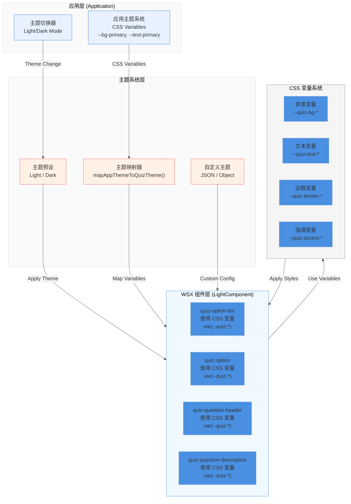
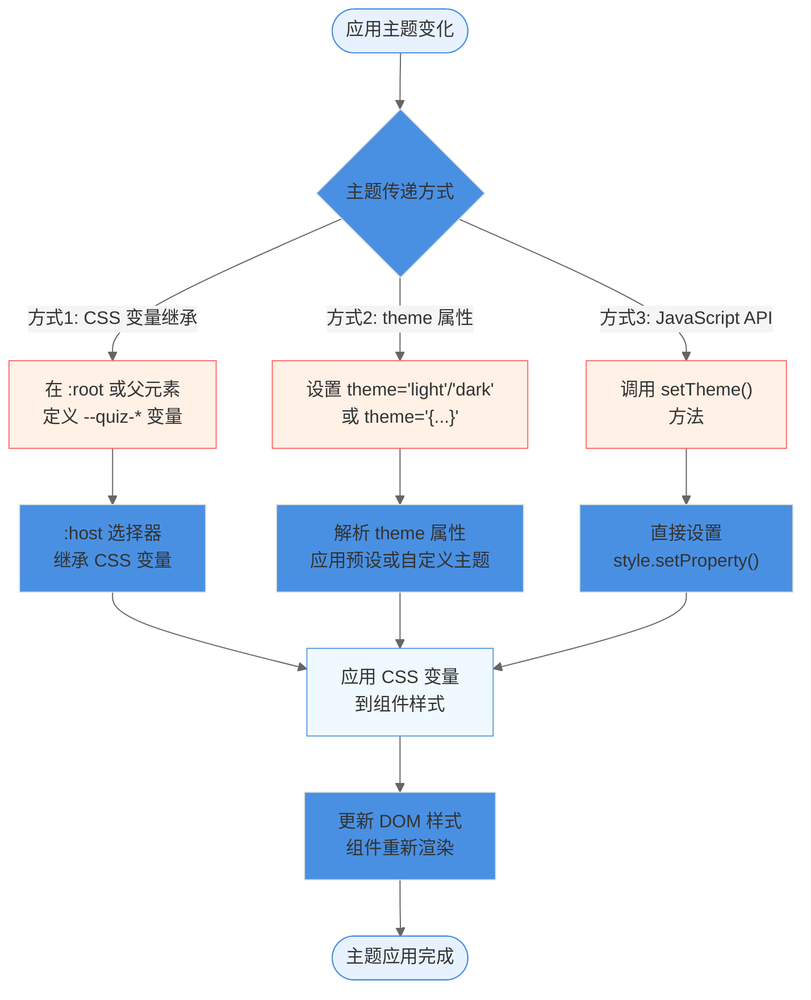
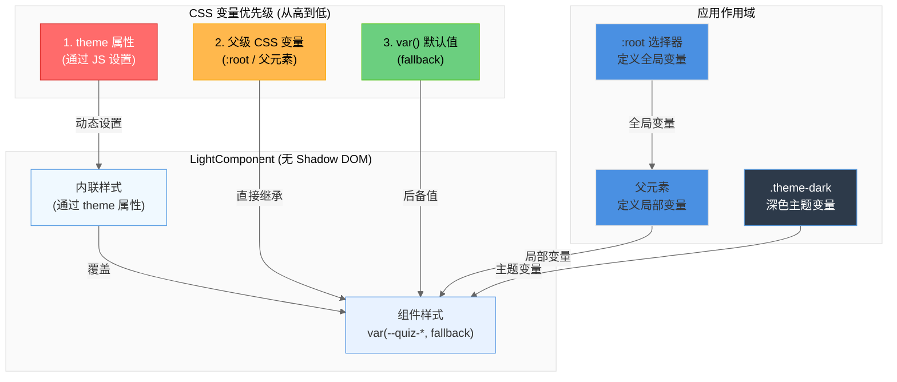

# RFC 0008: WSX 组件主题定制系统

**状态**: 草案  
**创建日期**: 2025-12-14  
**作者**: quizerjs 团队  
**相关 RFC**: [RFC 0005: Editor Core](./0005-editor-core.md), [RFC 0007: Option List Render Optimization](./0007-option-list-render-optimization.md)

## 摘要

本 RFC 定义了 quizerjs WSX 组件的主题定制系统，使组件能够响应应用层的主题变化，支持深色/浅色模式切换，并允许用户自定义主题颜色。**核心设计原则：组件完全主题无关（Theme-Agnostic）**，所有主题逻辑在应用层通过 CSS 变量处理，组件只需要使用 CSS 变量替代硬编码颜色值。

## 问题描述

### 当前问题

1. **硬编码颜色值**：所有 WSX 组件（`quiz-option-list`、`quiz-option`、`quiz-question-header`、`quiz-question-description`）都使用硬编码的颜色值（如 `#4a90e2`、`#333333`、`#ffffff`），无法响应主题变化。

2. **样式隔离**：WSX 组件使用 `LightComponent`（不使用 Shadow DOM），样式通过 `styleName` 作用域化，但硬编码的颜色值无法响应外部主题变化。

3. **样式过于固化**：组件样式设计过于具体，缺乏灵活性，用户无法轻松定制组件外观以匹配其应用设计。

4. **主题不一致**：当应用切换到深色模式时，WSX 组件仍然显示浅色样式，造成视觉不一致。

### 影响

- 用户体验差：深色模式下组件显示浅色样式，造成视觉冲突
- 定制困难：用户无法轻松调整组件颜色以匹配品牌风格
- 维护成本高：需要修改多个 CSS 文件才能改变组件样式
- 可访问性差：无法根据用户偏好调整对比度和颜色

## 设计目标

1. **主题响应**：组件能够自动响应应用层的主题变化（深色/浅色模式）
2. **CSS 变量支持**：使用 CSS 变量系统，支持通过属性或 CSS 变量传递主题
3. **向后兼容**：保持现有 API 不变，新主题系统作为增强功能
4. **易于定制**：提供清晰的变量命名规范和默认值
5. **性能优化**：主题切换不应影响组件性能
6. **类型安全**：提供 TypeScript 类型定义支持

## 设计方案

### 架构概览



### 1. CSS 变量命名规范

定义一套标准的 CSS 变量命名规范，覆盖所有组件需要的颜色和样式属性：

```css
/* 基础颜色变量 */
--quiz-bg-primary: <color>;        /* 主背景色 */
--quiz-bg-secondary: <color>;      /* 次背景色 */
--quiz-bg-tertiary: <color>;        /* 第三背景色 */
--quiz-bg-hover: <color>;          /* 悬停背景色 */
--quiz-bg-selected: <color>;       /* 选中背景色 */

/* 文本颜色变量 */
--quiz-text-primary: <color>;      /* 主文本色 */
--quiz-text-secondary: <color>;    /* 次文本色 */
--quiz-text-tertiary: <color>;      /* 第三文本色 */
--quiz-text-placeholder: <color>;  /* 占位符文本色 */

/* 边框颜色变量 */
--quiz-border-color: <color>;       /* 默认边框色 */
--quiz-border-hover: <color>;      /* 悬停边框色 */
--quiz-border-focus: <color>;       /* 焦点边框色 */
--quiz-border-selected: <color>;   /* 选中边框色 */

/* 强调色变量 */
--quiz-accent-color: <color>;      /* 强调色（按钮、链接等） */
--quiz-accent-hover: <color>;      /* 强调色悬停状态 */
--quiz-accent-active: <color>;     /* 强调色激活状态 */

/* 状态颜色变量 */
--quiz-success-color: <color>;     /* 成功状态色 */
--quiz-warning-color: <color>;     /* 警告状态色 */
--quiz-error-color: <color>;       /* 错误状态色 */
--quiz-info-color: <color>;        /* 信息状态色 */

/* 间距变量 */
--quiz-spacing-xs: <length>;       /* 超小间距（4px） */
--quiz-spacing-sm: <length>;       /* 小间距（8px） */
--quiz-spacing-md: <length>;       /* 中间距（12px） */
--quiz-spacing-lg: <length>;       /* 大间距（16px） */
--quiz-spacing-xl: <length>;       /* 超大间距（24px） */

/* 圆角变量 */
--quiz-radius-sm: <length>;        /* 小圆角（4px） */
--quiz-radius-md: <length>;         /* 中间角（6px） */
--quiz-radius-lg: <length>;        /* 大圆角（8px） */

/* 阴影变量 */
--quiz-shadow-sm: <shadow>;        /* 小阴影 */
--quiz-shadow-md: <shadow>;        /* 中阴影 */
--quiz-shadow-lg: <shadow>;        /* 大阴影 */

/* 字体变量 */
--quiz-font-size-sm: <length>;     /* 小字体（0.75rem） */
--quiz-font-size-base: <length>;   /* 基础字体（0.875rem） */
--quiz-font-size-lg: <length>;     /* 大字体（1rem） */
--quiz-font-size-xl: <length>;     /* 超大字体（1.25rem） */
--quiz-font-weight-normal: <weight>; /* 正常字重（400） */
--quiz-font-weight-medium: <weight>; /* 中等字重（500） */
--quiz-font-weight-semibold: <weight>; /* 半粗字重（600） */
```

### 2. 主题传递机制

由于 `LightComponent` 不使用 Shadow DOM，CSS 变量可以直接从父级作用域继承，但仍需要通过以下方式确保主题正确传递：

#### 主题传递流程图



#### 方案 A：通过 `:host` 和 CSS 变量继承（推荐）

在组件的 `:host` 选择器中定义 CSS 变量，并设置默认值。这些变量可以通过以下方式被覆盖：

1. **通过属性传递**：组件接受 `theme` 属性，值为 JSON 字符串或对象
2. **通过 CSS 变量继承**：在组件外部定义 CSS 变量，通过 `:host` 选择器继承
3. **通过 `part` 属性**：使用 `::part()` 伪元素选择器（需要启用 `part` 属性）

**CSS 变量优先级和继承关系**：



```css
/* 组件内部样式 */
:host {
  /* 定义默认值 */
  --quiz-bg-primary: #ffffff;
  --quiz-text-primary: #333333;
  --quiz-accent-color: #4a90e2;
  /* ... 其他变量 */
}

.quiz-option {
  background-color: var(--quiz-bg-primary);
  color: var(--quiz-text-primary);
  border-color: var(--quiz-border-color);
}
```

#### 方案 B：通过 JavaScript 动态设置 CSS 变量（高级）

在应用层通过 JavaScript 动态设置 CSS 变量：

```typescript
// 应用层代码
import { mapAppThemeToQuizTheme, themePresets } from '@quizerjs/core/themes';

function applyTheme(dark: boolean) {
  const preset = dark ? themePresets.dark : themePresets.light;
  
  // 直接设置到 :root
  Object.entries(preset).forEach(([key, value]) => {
    document.documentElement.style.setProperty(key, value);
  });
  
  // 或者映射应用主题
  const appTheme = {
    '--bg-primary': dark ? '#1a1a1a' : '#ffffff',
    '--text-primary': dark ? '#e0e0e0' : '#333333',
  };
  
  const quizTheme = mapAppThemeToQuizTheme(appTheme);
  Object.entries(quizTheme).forEach(([key, value]) => {
    document.documentElement.style.setProperty(key, value);
  });
}
```

**注意**：组件不需要任何修改，所有逻辑在应用层处理。

### 3. 默认主题定义（应用层使用）

提供两套预设主题的 CSS 变量定义，供应用层参考和使用。这些定义不在组件内部，而是在应用层的 CSS 或通过工具函数应用。

#### 浅色主题（默认）

```css
/* 应用层定义 - :root 或特定选择器 */
:root {
  --quiz-bg-primary: #ffffff;
  --quiz-bg-secondary: #fafafa;
  --quiz-bg-tertiary: #f5f5f5;
  --quiz-bg-hover: #f5f8ff;
  --quiz-bg-selected: #e8f2ff;
  
  --quiz-text-primary: #333333;
  --quiz-text-secondary: #666666;
  --quiz-text-tertiary: #999999;
  --quiz-text-placeholder: #999999;
  
  --quiz-border-color: #e0e0e0;
  --quiz-border-hover: #4a90e2;
  --quiz-border-focus: #4a90e2;
  --quiz-border-selected: #4a90e2;
  
  --quiz-accent-color: #4a90e2;
  --quiz-accent-hover: #357abd;
  --quiz-accent-active: #2a5f8f;
  
  --quiz-error-color: #ff4d4f;
  --quiz-success-color: #52c41a;
  --quiz-warning-color: #faad14;
  --quiz-info-color: #1890ff;
}
```

#### 深色主题

```css
/* 应用层定义 - .theme-dark 选择器 */
.theme-dark {
  --quiz-bg-primary: #1a1a1a;
  --quiz-bg-secondary: #262626;
  --quiz-bg-tertiary: #2d2d2d;
  --quiz-bg-hover: #2d3a4a;
  --quiz-bg-selected: #1e3a5f;
  
  --quiz-text-primary: #e0e0e0;
  --quiz-text-secondary: #b0b0b0;
  --quiz-text-tertiary: #808080;
  --quiz-text-placeholder: #666666;
  
  --quiz-border-color: #404040;
  --quiz-border-hover: #5a9de2;
  --quiz-border-focus: #5a9de2;
  --quiz-border-selected: #5a9de2;
  
  --quiz-accent-color: #5a9de2;
  --quiz-accent-hover: #4a8dd2;
  --quiz-accent-active: #3a7dc2;
  
  --quiz-error-color: #ff6b6b;
  --quiz-success-color: #6bcf7f;
  --quiz-warning-color: #ffb84d;
  --quiz-info-color: #4da6ff;
}
```

**关键点**：这些 CSS 变量定义在应用层，组件通过 CSS 变量继承自动使用，组件代码完全不需要知道主题的存在。

### 4. 组件实现方案

**核心原则：组件完全主题无关（Theme-Agnostic）**

组件不应该知道主题的存在，所有主题逻辑都在应用层处理。组件只需要：
1. 使用 CSS 变量替代硬编码颜色值
2. 提供合理的默认值（fallback）
3. 不处理任何主题相关的属性或逻辑

#### 4.1 组件样式重构（主题无关）

将所有硬编码的颜色值替换为 CSS 变量，使用 `var()` 函数的 fallback 机制提供默认值。组件不需要任何主题相关的代码：

```css
/* 重构前 */
.quiz-option {
  background-color: #ffffff;
  color: #333333;
  border: 1px solid #e0e0e0;
}

/* 重构后 - 使用 CSS 变量，带默认值 */
.quiz-option {
  background-color: var(--quiz-bg-primary, #ffffff);
  color: var(--quiz-text-primary, #333333);
  border: 1px solid var(--quiz-border-color, #e0e0e0);
}

/* 应用层定义变量（自动继承到组件） */
:root {
  --quiz-bg-primary: #ffffff;
  --quiz-text-primary: #333333;
  --quiz-border-color: #e0e0e0;
}

.theme-dark {
  --quiz-bg-primary: #1a1a1a;
  --quiz-text-primary: #e0e0e0;
  --quiz-border-color: #404040;
}
```

### 5. 应用层集成

#### 5.1 通过 CSS 变量传递主题

由于 `LightComponent` 不使用 Shadow DOM，CSS 变量可以直接从应用层继承。在应用层定义 CSS 变量，组件会自动使用：

```css
/* 应用层样式 - 浅色主题 */
:root {
  --bg-primary: #ffffff;
  --text-primary: #333333;
  --accent-color: #4a90e2;
  
  /* 映射应用主题变量到组件变量 */
  --quiz-bg-primary: var(--bg-primary);
  --quiz-text-primary: var(--text-primary);
  --quiz-accent-color: var(--accent-color);
  /* ... 其他变量映射 */
}

/* 深色模式 */
.theme-dark {
  --bg-primary: #1a1a1a;
  --text-primary: #e0e0e0;
  --accent-color: #5a9de2;
  
  /* 组件变量自动继承应用变量 */
  --quiz-bg-primary: var(--bg-primary);
  --quiz-text-primary: var(--text-primary);
  --quiz-accent-color: var(--accent-color);
  /* ... 其他变量映射 */
}
```

**主题切换流程图**：

```mermaid
%%{init: {'theme':'base', 'themeVariables': {'primaryColor':'#4a90e2','primaryTextColor':'#333','primaryBorderColor':'#e0e0e0','lineColor':'#666','secondaryColor':'#f5f5f5','tertiaryColor':'#fafafa'}}}%%
flowchart TD
    Start([用户切换主题]) --> Toggle[主题切换器<br/>toggleTheme()]
    
    Toggle --> UpdateApp[更新应用层 CSS 变量<br/>:root 或 .theme-dark]
    
    UpdateApp --> UpdateVars["更新 --quiz-* 变量<br/>映射应用变量"]
    
    UpdateVars --> Inherit[LightComponent<br/>自动继承 CSS 变量]
    
    Inherit --> ApplyStyles[组件样式应用变量<br/>var(--quiz-bg-primary, fallback)]
    
    ApplyStyles --> Reflow[浏览器重新计算样式<br/>CSS 变量更新]
    
    Reflow --> End([主题切换完成<br/>组件样式已更新])
    
    style Start fill:#e8f2ff,stroke:#4a90e2
    style Toggle fill:#fff1e6,stroke:#ff6b6b
    style UpdateApp fill:#f0f9ff,stroke:#5a9de2
    style UpdateVars fill:#f0f9ff,stroke:#5a9de2
    style Inherit fill:#e8f2ff,stroke:#4a90e2
    style ApplyStyles fill:#e8f2ff,stroke:#4a90e2
    style End fill:#6bcf7f,stroke:#52c41a
```

#### 5.2 通过 JavaScript 动态设置 CSS 变量

```typescript
import { mapAppThemeToQuizTheme, themePresets } from '@quizerjs/core/themes';
import { watch } from 'vue';

const isDark = ref(false);

// 监听主题变化，更新 CSS 变量
watch(isDark, (dark) => {
  // 方式 1：使用预设主题
  const preset = dark ? themePresets.dark : themePresets.light;
  Object.entries(preset).forEach(([key, value]) => {
    document.documentElement.style.setProperty(key, value);
  });
  
  // 方式 2：映射应用主题变量
  const appTheme = {
    '--bg-primary': dark ? '#1a1a1a' : '#ffffff',
    '--text-primary': dark ? '#e0e0e0' : '#333333',
    '--accent-color': dark ? '#5a9de2' : '#4a90e2',
  };
  
  const quizTheme = mapAppThemeToQuizTheme(appTheme);
  Object.entries(quizTheme).forEach(([key, value]) => {
    document.documentElement.style.setProperty(key, value);
  });
});
```

**注意**：组件不需要任何修改，所有主题切换逻辑在应用层处理。

### 6. 向后兼容性

1. **默认行为**：如果应用层不定义 CSS 变量，组件使用 `var()` 函数中的 fallback 默认值（浅色主题）
2. **渐进增强**：现有代码无需修改即可工作，主题系统作为可选增强
3. **降级处理**：如果 CSS 变量不被支持，使用 `var()` 中的 fallback 值作为后备
4. **组件无关性**：组件代码完全不变，所有主题逻辑在应用层处理

### 7. TypeScript 类型定义

提供类型定义支持：

```typescript
interface QuizTheme {
  '--quiz-bg-primary'?: string;
  '--quiz-text-primary'?: string;
  '--quiz-accent-color'?: string;
  // ... 其他变量
}

interface QuizThemePreset {
  light: QuizTheme;
  dark: QuizTheme;
}

// 组件属性类型
interface QuizComponentAttributes {
  theme?: 'light' | 'dark' | string; // JSON 字符串或预设名称
}
```

## 实施计划

### 阶段 1：CSS 变量系统基础（1-2 周）

1. 定义完整的 CSS 变量命名规范
2. 创建主题变量定义文件和预设主题
3. 重构所有组件的 CSS，使用 CSS 变量替换硬编码值
4. 确保组件保持主题无关，不添加任何主题相关代码

### 阶段 2：应用层集成（1 周）

1. 创建主题工具函数（`mapAppThemeToQuizTheme`、`themePresets`）
2. 更新 demo 应用，展示 CSS 变量传递主题
3. 添加主题切换示例
4. 更新文档和迁移指南

### 阶段 3：高级功能（可选，1-2 周）

1. 提供主题生成工具
2. 添加主题预览功能
3. 性能优化和测试
4. 可访问性验证（WCAG 对比度检查）

## 实施细节

### 1. 文件结构

```
packages/core/src/
├── components/
│   ├── quiz-option-list.wsx
│   ├── quiz-option-list.css
│   ├── quiz-option.wsx
│   ├── quiz-option.css
│   ├── quiz-question-header.wsx
│   ├── quiz-question-header.css
│   ├── quiz-question-description.wsx
│   └── quiz-question-description.css
└── themes/
    ├── index.ts              # 主题导出
    ├── variables.ts          # CSS 变量定义
    ├── presets.ts            # 预设主题
    └── types.ts              # TypeScript 类型定义
```

### 2. 组件修改示例

#### quiz-option-list.css

```css
/* 注意：LightComponent 不使用 Shadow DOM，不需要 :host 选择器 */
/* CSS 变量直接从父级作用域继承，使用 var() 的 fallback 提供默认值 */

.quiz-option-list {
  margin: var(--quiz-spacing-lg, 16px) 0;
}

.quiz-option-list-title {
  font-size: var(--quiz-font-size-base, 0.875rem);
  font-weight: var(--quiz-font-weight-semibold, 600);
  color: var(--quiz-text-secondary, #666666);
}

.quiz-option-list-add-button {
  padding: var(--quiz-spacing-sm, 6px) var(--quiz-spacing-md, 12px);
  border: 1px solid var(--quiz-accent-color, #4a90e2);
  border-radius: var(--quiz-radius-sm, 4px);
  background-color: var(--quiz-accent-color, #4a90e2);
  color: #ffffff; /* 按钮文字始终为白色 */
  cursor: pointer;
  font-size: var(--quiz-font-size-base, 0.875rem);
  transition: all 0.2s ease;
}

.quiz-option-list-add-button:hover {
  background-color: var(--quiz-accent-hover, #357abd);
  border-color: var(--quiz-accent-hover, #357abd);
}
```

#### quiz-option-list.wsx

**组件保持主题无关，不需要任何主题相关代码**：

```typescript
@autoRegister({ tagName: 'quiz-option-list' })
export class QuizOptionList extends LightComponent {
  // 组件不包含任何主题相关的状态或方法
  // 所有主题逻辑在应用层通过 CSS 变量处理

  static get observedAttributes() {
    return ['options', 'type', 'readonly'];
    // 注意：不包含 'theme' 属性
  }

  protected onAttributeChanged(name: string, _oldValue: string, newValue: string) {
    switch (name) {
      case 'options':
        // ... 处理选项
        break;
      case 'type':
        // ... 处理类型
        break;
      case 'readonly':
        // ... 处理只读模式
        break;
      // 不处理 theme 属性
    }
  }
}
```

### 3. 主题工具函数（应用层使用）

这些工具函数在应用层使用，组件不直接使用：

```typescript
// packages/core/src/themes/presets.ts
// 提供预设主题的 CSS 变量定义（供应用层参考和使用）
export const themePresets = {
  light: {
    '--quiz-bg-primary': '#ffffff',
    '--quiz-text-primary': '#333333',
    // ... 其他变量
  },
  dark: {
    '--quiz-bg-primary': '#1a1a1a',
    '--quiz-text-primary': '#e0e0e0',
    // ... 其他变量
  },
};

// packages/core/src/themes/utils.ts
// 帮助应用层将应用主题变量映射到组件变量
export function mapAppThemeToQuizTheme(appTheme: {
  '--bg-primary'?: string;
  '--text-primary'?: string;
  '--accent-color'?: string;
}): Record<string, string> {
  return {
    '--quiz-bg-primary': appTheme['--bg-primary'] || '#ffffff',
    '--quiz-text-primary': appTheme['--text-primary'] || '#333333',
    '--quiz-accent-color': appTheme['--accent-color'] || '#4a90e2',
    // ... 映射其他变量
  };
}

// 应用层使用示例
import { mapAppThemeToQuizTheme } from '@quizerjs/core/themes';

// 在应用层设置 CSS 变量
const quizTheme = mapAppThemeToQuizTheme({
  '--bg-primary': '#1a1a1a',
  '--text-primary': '#e0e0e0',
  '--accent-color': '#5a9de2',
});

// 应用到 :root 或特定元素
Object.entries(quizTheme).forEach(([key, value]) => {
  document.documentElement.style.setProperty(key, value);
});
```

## 使用示例

### 示例 1：通过 CSS 变量传递主题（推荐方式）

```css
/* 应用层定义 CSS 变量 */
:root {
  --bg-primary: #ffffff;
  --text-primary: #333333;
  --accent-color: #4a90e2;
  
  /* 映射到组件变量 */
  --quiz-bg-primary: var(--bg-primary);
  --quiz-text-primary: var(--text-primary);
  --quiz-accent-color: var(--accent-color);
}

/* 深色模式 */
.theme-dark {
  --bg-primary: #1a1a1a;
  --text-primary: #e0e0e0;
  --accent-color: #5a9de2;
  
  /* 组件变量自动更新 */
  --quiz-bg-primary: var(--bg-primary);
  --quiz-text-primary: var(--text-primary);
  --quiz-accent-color: var(--accent-color);
}
```

```html
<!-- 组件自动继承 CSS 变量，无需任何属性 -->
<quiz-option-list />
<quiz-option />
<quiz-question-header />
```

### 示例 2：使用主题工具函数

```typescript
import { mapAppThemeToQuizTheme, themePresets } from '@quizerjs/core/themes';
import { watch } from 'vue';

const isDark = ref(false);

// 监听主题变化，更新 CSS 变量
watch(isDark, (dark) => {
  const preset = dark ? themePresets.dark : themePresets.light;
  
  // 直接应用预设主题
  Object.entries(preset).forEach(([key, value]) => {
    document.documentElement.style.setProperty(key, value);
  });
  
  // 或者映射应用主题
  const appTheme = {
    '--bg-primary': dark ? '#1a1a1a' : '#ffffff',
    '--text-primary': dark ? '#e0e0e0' : '#333333',
    '--accent-color': dark ? '#5a9de2' : '#4a90e2',
  };
  
  const quizTheme = mapAppThemeToQuizTheme(appTheme);
  Object.entries(quizTheme).forEach(([key, value]) => {
    document.documentElement.style.setProperty(key, value);
  });
});
```

### 示例 3：自定义主题变量

```css
/* 应用层定义自定义主题 */
:root {
  --quiz-bg-primary: #f0f0f0;
  --quiz-text-primary: #222222;
  --quiz-accent-color: #ff6b6b;
  /* ... 其他自定义变量 */
}
```

```html
<!-- 组件自动使用自定义变量 -->
<quiz-option-list />
```

## 测试策略

1. **单元测试**：测试主题预设和应用逻辑
2. **视觉回归测试**：确保主题切换后组件外观正确
3. **兼容性测试**：测试不同浏览器的 CSS 变量支持
4. **性能测试**：确保主题切换不影响组件性能
5. **可访问性测试**：确保主题切换后对比度符合 WCAG 标准

## 风险评估

1. **浏览器兼容性**：CSS 变量在旧浏览器中可能不支持（需要 polyfill 或降级方案）
2. **性能影响**：大量 CSS 变量可能影响渲染性能（需要通过性能测试验证）
3. **迁移成本**：现有代码需要更新以使用新主题系统（提供迁移指南）
4. **维护成本**：需要维护多套主题和变量定义（通过工具和文档降低）

## 后续优化

1. **主题编辑器**：提供可视化主题编辑器工具
2. **主题市场**：允许用户分享和下载主题
3. **自动主题检测**：自动检测系统主题偏好
4. **动画支持**：主题切换时的过渡动画
5. **主题验证**：验证主题配置的完整性和有效性

## 参考

- [CSS Custom Properties (Variables)](https://developer.mozilla.org/en-US/docs/Web/CSS/Using_CSS_custom_properties)
- [Shadow DOM and CSS Variables](https://developer.mozilla.org/en-US/docs/Web/Web_Components/Using_shadow_DOM)
- [Web Components Best Practices](https://web.dev/custom-elements-best-practices/)
- [Material Design Theming](https://material.io/design/material-theming/overview.html)
- [Ant Design Theme](https://ant.design/docs/react/customize-theme)

## 附录

### A. 完整 CSS 变量列表

见 `packages/core/src/themes/variables.ts`

### B. 迁移指南

见 `docs/guide/theming-migration.md`

### C. 主题示例

见 `docs/examples/theming.md`
