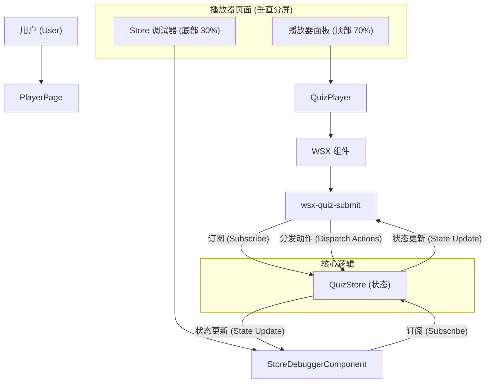
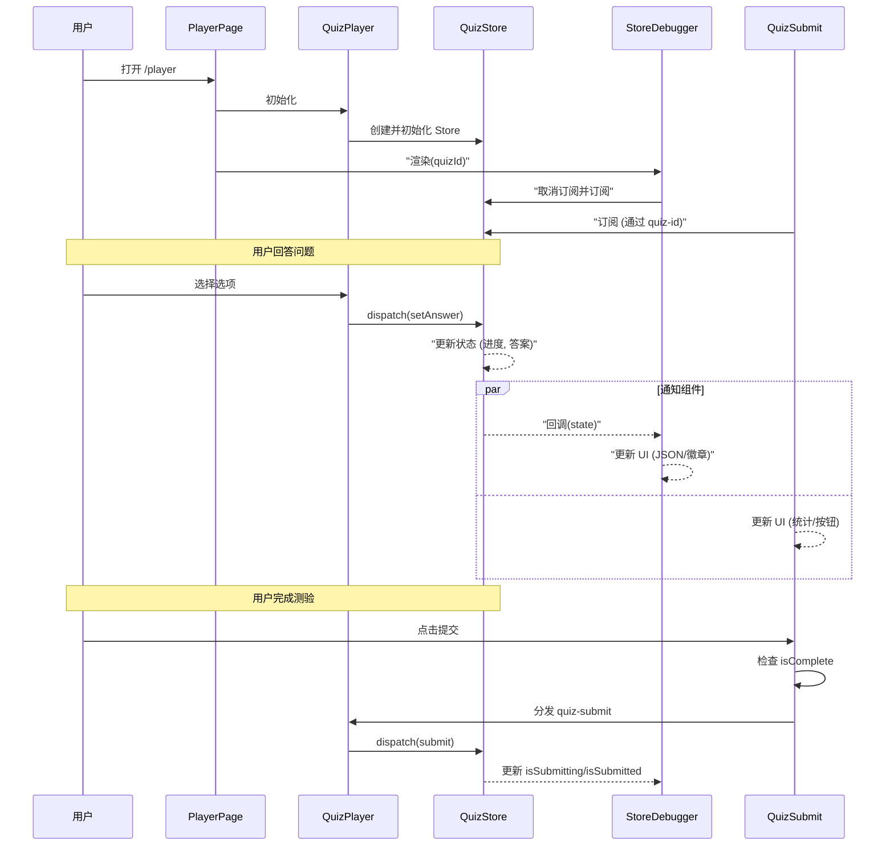

# RFC 0011: 演示播放器调试器与布局 (Demo Player Debugger & Layout)

**状态**: 已完成 (Completed)
**创建日期**: 2026-01-20
**实施日期**: 2026-01-20

## 摘要 (Summary)

增强演示播放器页面（Demo Player Page），提供一个强大的调试环境。新的布局采用了垂直分屏设计：主播放器区域（最大化）和底部的“Store 调试器”面板。该调试器直观展示 `QuizStore` 的实时状态。此外，`QuizSubmit` 组件也得到了增强，能够提供更清晰的完成状态反馈。

## 动机 (Motivation)

1.  **可视化 (Visibility)**：开发者需要同时看到内部 `QuizStore` 状态（答案、进度、标志）和 UI，以验证正确性。
2.  **调试 (Debugging)**：诸如“提交卡住”或“进度未更新”等问题，如果不查看底层状态很难诊断。
3.  **屏幕空间利用 (Use of Screen Estate)**：当前的播放器演示可能浪费空间。分屏视图能更好地利用垂直空间来放置调试工具。
4.  **提交体验 (Submission UX)**：用户需要清楚的反馈，了解为什么不能提交（例如：题目未完成）。

## 设计 (Design)

### 架构图 (Architecture Diagram)

### 交互时序图 (Interaction Sequence Diagram)

### 布局 (Layout)

- **容器**: 使用 `react-resizable-panels` 实现垂直方向布局。
- **顶部面板 (播放器)**: Flex-grow (70% 高度)。可滚动的播放器区域。
- **底部面板 (调试器)**: 可调整大小 (30% 高度)。专用的调试视图。
- **样式**: 对所有容器应用 `h-full` 以防止高度塌陷。

### StoreDebugger 组件

一个 React 组件，用于：

1.  **订阅**: 通过 `getQuizStoreById` 订阅 `QuizStore`。
2.  **显示**:
    - **状态标志**: `isSubmitting` (正在提交), `isSubmitted` (已提交) (带颜色编码的徽章)。
    - **进度**: `answered` (已答) / `total` (总数)。
    - **答案**: `answers` 记录的实时 JSON 视图。
    - **状态快照**: 完整的 Store 状态转储。

### QuizSubmit 增强

`<wsx-quiz-submit>` 组件已更新，以支持调试工作流：

1.  **进度统计**: 显示“已完成”、“剩余”、“总计”数量。
2.  **验证**: 按钮在 `answered >= total` 之前严格禁用。
3.  **兼容性**: 添加了 `label` 属性作为 `button-text` 的别名。

## 实施结果 (Implementation Results)

### 1. StoreDebugger (`demos/react/src/components/StoreDebugger.tsx`)

- 实现了实时 Store 订阅更新。
- 使用 `JsonViewer` 进行可读的数据展示。
- 处理了 Store 初始化时的轮询等待。

### 2. Player Page Layout (`demos/react/src/pages/PlayerPage.tsx`)

- 集成了 `react-resizable-panels`。
- 通过强制容器 `height: 100%` 修复了高度塌陷问题。
- 解析 `dslPreview` 以提取用于调试器的动态 `quizId`。

### 3. QuizSubmit Component (`packages/core/src/components/quiz-submit.wsx`)

- 添加了基于 Store 的实时进度跟踪。
- 实现了可视化的统计块。
- 修复了 `label`与 `button-text` 属性不匹配的问题。

## 验收标准 (Acceptance Criteria)

- [x] 播放器占据屏幕主要部分 (顶部 70%)。
- [x] 调试器面板显示实时 `QuizStore` 状态 (底部 30%)。
- [x] 调试器清晰显示 `isSubmitting` 状态。
- [x] 当测验未完成时，提交按钮被禁用。
- [x] 提交按钮文字可以通过 `label` 或 `button-text` 正确渲染。
