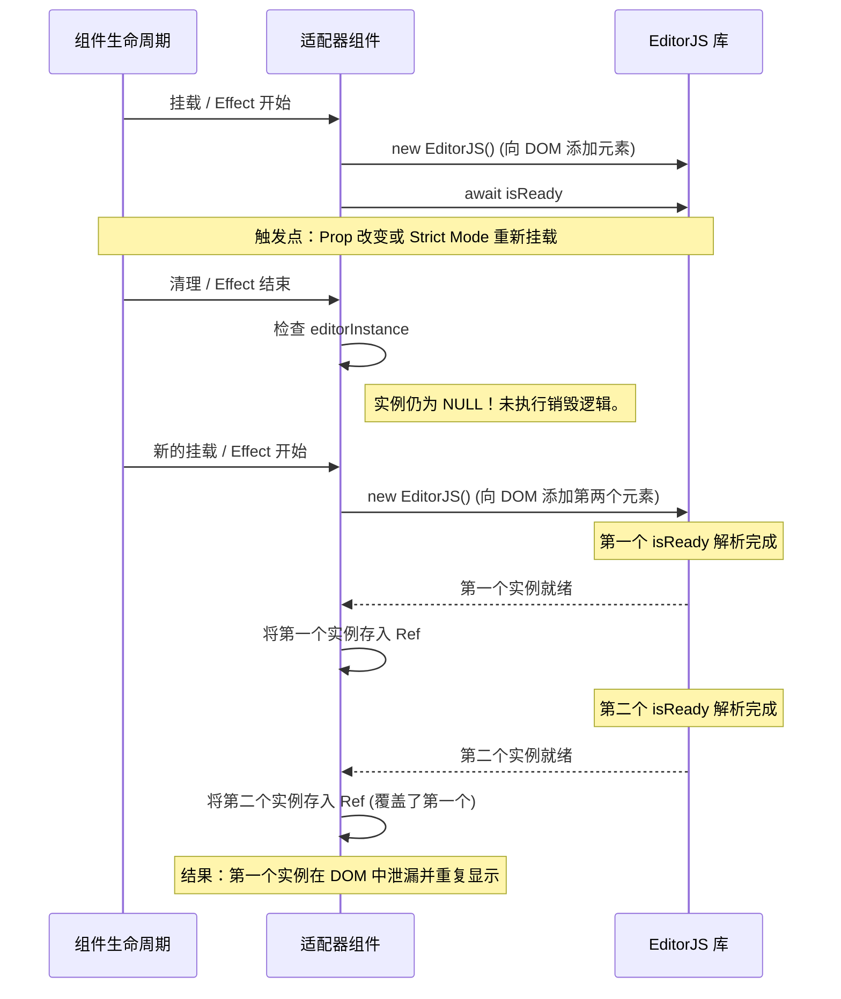

# RFC 0014: 修复 EditorJS 适配器中的异步初始化竞态问题

## 状态

- **状态**: 已提议 (Proposed)
- **作者**: Antigravity (The Quiz Architect)
- **日期**: 2026-02-01
- **关联问题**: React 包中出现的 "2 editorjs are rendered" 重现问题

## 摘要

本 RFC 旨在解决所有 `@quizerjs` 框架适配器（React, Vue, Svelte）中存在的一个共同问题：EditorJS 的异步初始化可能导致重复渲染和实例泄漏。当组件生命周期（如重新挂载或 attribute/prop 更新）在之前的异步初始化完成前触发了新的初始化时，就会发生这种情况。

## 根因分析

### 异步失调 (Async Mismatch)

所有三个框架（React, Vue, Svelte）的生命周期清理方法（`useEffect` cleanup, `onBeforeUnmount`, `onDestroy`）都是同步执行的。然而，`QuizEditor.init()` 方法为了等待 `editor.isReady` 而是异步的。



### 框架特定表现

1.  **React**: 由于 `React.StrictMode` 在开发环境下的双重 Effect 调用以及 `useEffect` 对依赖项的敏感性，此问题出现的频率最高。
2.  **Vue**: 如果在 `onMounted` 完成前 `initialDSL` 快速变化，可能会触发此问题。虽然 Vue 的 `onMounted` 只执行一次，但其他监听器（watchers）可能引入类似的异步竞态。
3.  **Svelte**: 与 Vue 类似，如果组件在 `await` 完成前被销毁，`onDestroy` 可能无法正确捕获并销毁正在初始化的实例。

## 提议的修复方案

核心解决方案是在初始化作用域内引入一个 `isMounted` 或 `isCancelled` 标志位。确保如果初始化在组件生命周期结束后才完成，则立即将其销毁。

### React (@quizerjs/react)

修改 `QuizEditor.tsx`，在 `useEffect` 内部使用局部的 `isMounted` 标志位。

```tsx
useEffect(() => {
  let isMounted = true;
  const init = async () => {
    const editor = new QuizEditor(options);
    await editor.init();
    if (!isMounted) {
      editor.destroy();
      return;
    }
    editorRef.current = editor;
  };
  init();
  return () => {
    isMounted = false; /* ... 销毁当前实例 ... */
  };
}, [deps]);
```

### Vue (@quizerjs/vue)

修改 `QuizEditor.vue` 以跟踪挂载状态。

```ts
let isMounted = true;
onMounted(async () => {
  const instance = new QuizEditor(options);
  await instance.init();
  if (!isMounted) {
    instance.destroy();
    return;
  }
  editor = instance;
});
onBeforeUnmount(() => {
  isMounted = false;
  if (editor) editor.destroy();
});
```

### Svelte (@quizerjs/svelte)

修改 `QuizEditor.svelte`。

```js
let mounted = true;
onMount(async () => {
  const instance = new QuizEditor(options);
  await instance.init();
  if (!mounted) {
    instance.destroy();
    return;
  }
  editorInstance = instance;
});
onDestroy(() => {
  mounted = false;
  if (editorInstance) editorInstance.destroy();
});
```

## 验证计划

### 手动验证

1.  **React**: 在 `demos/react` 中开启 `StrictMode`。快速切换示例，验证 DOM 中仅存在 1 个编辑器。
2.  **Vue**: 打开 `demos/vue`。快速切换示例，验证 DOM 中仅存在 1 个编辑器。
3.  **Svelte**: 打开 `demos/svelte`。快速切换示例，验证 DOM 中仅存在 1 个编辑器。

## 结论

标准化所有适配器的异步初始化生命周期将显著提升系统稳定性，并防止像 Quiz Builder 这样高交互场景中常见的内存和 DOM 泄漏。
