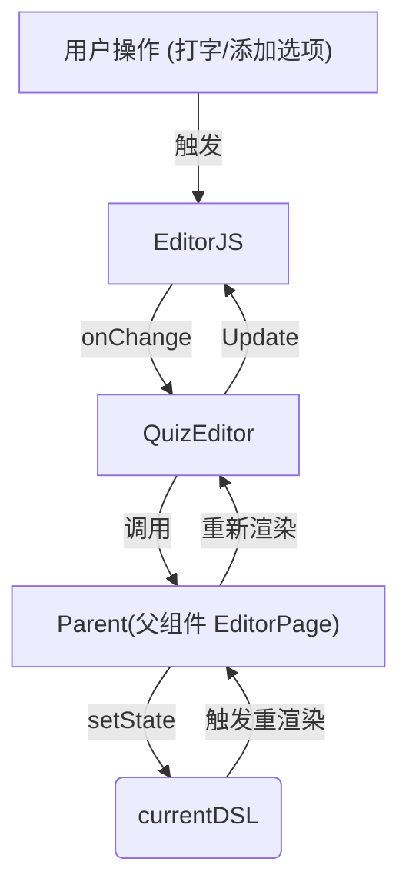

# RFC 0015: React Editor 组件渲染循环修复

## 状态

- **状态**: 已提议 (Proposed)
- **作者**: Antigravity
- **日期**: 2026-02-01
- **关联问题**: React 下添加选项导致其他已存在选项消失；编辑器内容重置。

## 摘要

本 RFC 详细阐述了在 React 中集成 Editor.js 时遇到的 "渲染循环" (Rendering Loop) 问题及其根因。该问题导致用户在编辑时（如添加选项），React 组件发生不必要的重渲染，进而干扰或重置了 Editor.js 的内部 DOM 状态。修复方案是采用 `React.memo` 进行激进的组件隔离，并优化 `useEffect` 依赖策略。

## 根因分析

### 1. 渲染反馈循环 (The Feedback Loop)

在 React 单向数据流中，`QuizEditor` 组件通常通过 Props 接收数据 (`initialDSL`) 并通过回调 (`onChange`) 上报数据。



**问题所在**：
Editor.js 是一个直接操作 DOM 的库，它维护自己的内部状态。当 React 父组件 (`EditorPage`) 因为 `currentDSL` 更新而重渲染时，它会重新渲染 `<QuizEditor />` 子组件。
即使我们使用了 `useEffect` 来避免重复 `init()`，React 的重渲染机制（Re-rendering）本身可能会导致：

1.  传递给组件的 Props（如函数引用）发生变化。
2.  组件函数体重新执行。
3.  如果在组件内部逻辑中有任何对 Props 的依赖响应（例如旧代码中依赖 `initialDSL` 的 Effect），Editor.js 实例会被销毁重建或重新加载数据 (`load()`)。

**导致的现象**：
用户添加一个选项 -> `onChange` 触发 -> 父组件更新 -> 父组件重渲染 -> `QuizEditor` 重渲染 -> 触发数据重载 -> **编辑器重置为初始状态（或旧状态），刚添加的选项丢失。**

### 2. 初始化逻辑的误用 (Initialize-Only vs Reactive)

原有的实现试图让 Editor "响应" `initialDSL` 的变化：

```tsx
// 错误模式
useEffect(() => {
  editor.load(initialDSL);
}, [initialDSL]);
```

当父组件为了预览功能更新 `initialDSL` (或混合了 current/initial 状态) 时，这个 Effect 会被触发，导致编辑器在用户编辑过程中强制刷新，打断用户操作并丢失临时状态。

## 解决方案

### 1. 组件隔离 (Memoization)

我们需要将 React 的响应式更新与 Editor.js 的命令式 DOM 操作完全隔离开。React **不应**仅仅因为父组件重渲染了就去打扰 Editor.js。

通过使用 `React.memo`，我们强制 `QuizEditor` 仅在极少数关键 Props（`initialDSL` 引用变更或 `readOnly` 切换）发生真实变化时才重渲染。

```tsx
// packages/react/src/QuizEditor.tsx

export const QuizEditor = React.memo(QuizEditorComponent, (prevProps, nextProps) => {
  // 只有当 initialDSL 或 readOnly 显式改变时才允许 React 更新组件
  // 忽略函数 Props (onChange, onSave) 的变化
  return prevProps.initialDSL === nextProps.initialDSL && prevProps.readOnly === nextProps.readOnly;
});
```

### 2. "仅初始化" 策略 (Initialize-Only Pattern)

将 `useEffect` 的依赖数组设为空 `[]`，确保 Editor.js 仅在组件挂载时初始化一次。后续的数据更新（如切换 Sample）必须通过显式的 Ref 方法调用 (`ref.current.load()`) 来完成，而不是依赖 Props 的自动响应。

```tsx
// packages/react/src/QuizEditor.tsx

useEffect(() => {
  // 初始化逻辑...
}, []); // 依赖为空，永不自动运行
```

### 3. 处理函数引用不稳定性

父组件传递的 `onChange` 回调如果未使用 `useCallback` 包装，每次渲染都会生成新引用。虽然 `React.memo` 忽略了它，但在组件内部我们使用 `useRef` 来保持最新引用，从而不需要将其加入 `useEffect` 依赖。

```tsx
const onChangeRef = useRef(onChange);
useEffect(() => {
  onChangeRef.current = onChange;
}, [onChange]);
```

## 结论

在集成像 Editor.js 这样管理自己 DOM 的第三方库时，必须打破 React 默认的 "渲染即同步" update 循环。通过 `React.memo` 充当防火墙，以及 "Initialize-Only" 的生命周期管理，我们成功解决了数据丢失和焦点跳动的问题。
